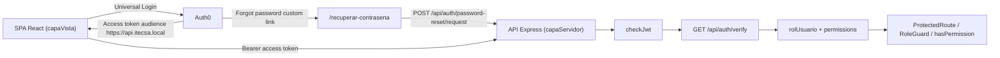
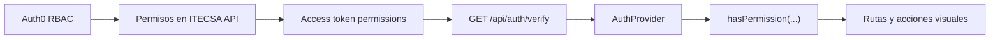

# Arquitectura - ITECSA

## Vision General

ITECSA utiliza una SPA React para la experiencia de usuario y una API Express para validar autenticacion, rol y permisos. Auth0 autentica al usuario, administra las contrasenas y emite access tokens destinados a la API ITECSA. La API persiste datos de negocio en MySQL/Aiven mediante Prisma y el adaptador MariaDB.



## Recursos Auth0

- SPA: `ITECSA Frontend Local`.
- API: `ITECSA API`, con audience `https://api.itecsa.local`.
- API `ITECSA API`: scopes declarados `view:main-navigation`, `view:kanban-module`, `view:payments-module`, `view:own-profile`, `view:orders-module`, `create:users-visually`, `manage:users-visually`, `update:payment-status` y `move:kanban-to-production`.
- M2M backend: `ITECSA Backend Management`, usada solo por Express para Auth0 Management API con token validado para `create:users`, `read:roles`, `read:users` y `update:users`.
- Action Post Login: `ITECSA Add Claims`.
- Conexion Database: `Username-Password-Authentication`.
- Roles permitidos: `Administrador Produccion`, `Soporte`, `Gerencia`, `Operario Produccion`, `Operario Ventas` y `Operario Cobranzas`.

No se documentan secretos reales. Los `client_id` son identificadores publicos; el secret M2M queda fuera del repositorio y no se expone al frontend.

El tenant usa Classic Universal Login con template personalizado gratuito. El template mantiene `allowSignUp: false`, limita la conexion a `Username-Password-Authentication` y reemplaza el link nativo de recuperacion por `/recuperar-contrasena` en la SPA. Los mensajes de Lock para `unauthorized`, `lock.unauthorized`, `blocked_user` y `too_many_attempts` se personalizan para evitar una experiencia ambigua en cuentas bloqueadas.

## Flujo De Autenticacion

1. `Auth0Provider` configura la SPA con dominio, client ID, audience de la API y URL de retorno.
2. El usuario inicia sesion mediante Universal Login; la SPA no captura ni persiste contrasenas.
3. Auth0 emite un access token destinado a `https://api.itecsa.local`.
4. La Action Post Login agrega claims namespaced al access token:
   - `https://itecsa.local/roles`: roles oficiales obtenidos desde Auth0 RBAC.
   - `https://itecsa.local/email`: correo provisto por Auth0 para identificar la sesion en la respuesta de verificacion.
5. Auth0 agrega el claim estandar `permissions` cuando RBAC y `Add Permissions in the Access Token` estan activos para `ITECSA API`.
6. La SPA llama `GET /api/auth/verify` mediante `authApi.verify()` y bearer token Auth0.
7. El backend valida issuer, audience, email, rol unico permitido y formato de permisos.
8. La API devuelve `rolUsuario`, `isAdministrador` y `permissions` para que la SPA controle navegacion y experiencia visual.

Si Auth0 rechaza el inicio de sesion por cuenta `blocked`, la SPA conserva el error del SDK Auth0 React, no relanza automaticamente `loginWithRedirect()` y muestra el mensaje de cuenta desactivada. Esto evita un bucle visual de retorno al Universal Login.

## Recuperacion Publica De Contrasena

El usuario inicia la recuperacion desde el link personalizado de Classic Universal Login hacia `/recuperar-contrasena`. La SPA no consulta Auth0 directamente; envia el correo al backend mediante `POST /api/auth/password-reset/request`.

El backend normaliza el correo y consulta la tabla interna `Usuario`. Solo las cuentas habilitadas provocan una solicitud a Auth0 mediante `/dbconnections/change_password`; las cuentas inexistentes o desvinculadas no generan envío.

Para todas las solicitudes con formato válido, la API devuelve el mismo status `200`, estructura y mensaje genérico: `Si existe una cuenta habilitada asociada a este correo, recibirás instrucciones para restablecer tu contraseña.` La respuesta no revela existencia, estado interno ni resultado del envío. Errores de entrega se registran sin correo ni contenido sensible y conservan la respuesta pública uniforme. El flujo nunca retorna tickets, enlaces, tokens ni contraseñas a la SPA.

El endpoint tiene límites independientes en memoria: 20 solicitudes por IP y 5 por correo normalizado en una ventana fija de 15 minutos, con purga al recibir solicitudes y barrido programado cada minuto; el mapa está limitado a 10.000 claves. Un `429` usa el mismo mensaje para cualquiera de las cuotas. La cuota es local al proceso y no se comparte entre réplicas. No se habilita `trust proxy` ni se confía en `X-Forwarded-For`; **la configuración de proxy queda pendiente de validación del despliegue**.

## Validacion Y Recuperacion De PIN

La validación del PIN usa una transacción Prisma interactiva y bloquea la fila del usuario con `SELECT ... FOR UPDATE`. Los intentos incorrectos quedan serializados por cuenta: el quinto aplica el bloqueo existente de 15 minutos y reinicia el contador a cero; un PIN correcto limpia contador y bloqueo vencido. Si una validación correcta y una incorrecta concurren, el orden de adquisición del bloqueo define el resultado: incorrecto seguido de correcto termina en cero; correcto seguido de incorrecto registra un intento. Si el quinto intento incorrecto se confirma primero, las validaciones posteriores esperan y encuentran el PIN bloqueado.

Solicitar un código de recuperación también bloquea la fila del usuario, invalida los retos no utilizados e inserta el nuevo reto en la misma transacción. La confirmación consume el reto mediante una actualización condicional que exige que pertenezca al usuario, esté entregado, siga vigente, no haya sido usado y conserve intentos disponibles. Solo una actualización puede modificar una fila; el cambio de credencial PIN y el consumo se confirman en una transacción conjunta, por lo que un fallo revierte ambos. Los intentos incorrectos incrementan el contador de forma atómica y el quinto invalida el reto. La expiración actual de 15 minutos se conserva.

## Autorizacion

- La fuente vigente de roles es Auth0 RBAC.
- El backend no confia en roles calculados por el frontend.
- La API recibe un arreglo en `https://itecsa.local/roles` y acepta exactamente un rol oficial.
- `rolUsuario` es la proyeccion singular que la API devuelve a partir del unico rol valido.
- Cualquier `app_metadata.rolUsuario` heredado en usuarios existentes es auxiliar y no reemplaza RBAC ni debe usarse como fuente de autorizacion.
- `ProtectedRoute`, `RoleGuard`, `hasPermission(...)` y `/access-denied` son controles de experiencia visual.
- Toda accion sensible debe validarse en backend con `checkJwt` y un middleware o regla de autorizacion propia.

Flujo de permisos visuales:



## Creacion Administrativa De Usuarios

Los endpoints bajo `/api/admin/users` requieren JWT, identidad activa y `manage:users`, con alcance departamental definido en `shared/authorization.js`. La creación acepta JSON con nombre, apellido, RUT, correo y rol. Genera el PIN; no recibe firmas ni contraseñas.

El backend usa `ITECSA Backend Management` para:

- Obtener un token M2M solo en servidor.
- Resolver el rol Auth0 RBAC existente.
- Crear el usuario en `Username-Password-Authentication`.
- Asignar el rol RBAC al usuario.
- Registrar la entidad interna `Usuario` con datos personales de negocio.
- Solicitar el correo de establecimiento/cambio de contrasena mediante Auth0.

La contrasena temporal generada para la creacion Database existe solo en memoria durante la llamada a Auth0. ITECSA no recibe, almacena ni persiste contrasenas, tickets ni enlaces de cambio de contrasena.

La gestion administrativa usa la tabla interna `Usuario` para listar, resumir, editar y desvincular usuarios. Las ediciones de correo, rol y estado se sincronizan con Auth0 Management API, mientras nombre, apellido, RUT siguen siendo datos internos de negocio.

## Persistencia Y Modulos De Negocio

El backend usa Prisma con `@prisma/adapter-mariadb` para conectar a MySQL/Aiven. Los repositorios de usuarios, pedidos, clientes, productos, estados de pedido, estados de pago, detalles y registros de pago consultan o actualizan la base real cuando el endpoint correspondiente se ejecuta.

Estado funcional actual:

- `/pagos` consume `GET /api/orders/payments`, `GET /api/orders/:orderId/payment-records/preview` (datos JSON) y `PATCH /api/orders/:orderId/payment-status` con PIN.
- Al confirmar un pago, el backend resuelve `Registro_Pago.id_usuario` desde `req.auth.payload.sub`, registra auditoria y mueve el pedido a `Listo para produccion`.
- Un pago ya confirmado no puede devolverse a `Pendiente` ni `Rechazado`; el backend responde conflicto y no genera auditoria nueva.
- Kanban consume `GET /api/orders` y `GET /api/order-status`, mueve etapas con `PATCH /api/orders/:orderId/move`, bloquea saltos o retrocesos y exige `move:kanban-to-production` para mover a `En produccion`.
- El movimiento devuelve los campos de etapa (`id_pedido`, `id_estado_pedido`, `id_etapa_general`, `generalStepId`, `nombre_etapa_general`), no el pedido completo. Kanban aplica estos campos sobre la tarjeta existente y conserva productos, cliente, pago y etiquetas. Si etapa o pago cambiaron desde la validacion, responde 409; las escrituras y la auditoria siguen en una transaccion. Una solicitud a la etapa actual devuelve el estado reducido sin escribir.
- `/ordenes/nuevo` consulta la nota por API y registra el pedido mediante `POST /api/orders`; mantiene el borrador en memoria React.
- El módulo de documentos/PDF y firmas fue retirado. Las notas de venta se consultan como datos estructurados desde el fixture local hasta disponer de integración autorizada.

## Variables De Entorno

Frontend:

```dotenv
VITE_AUTH0_DOMAIN=<tenant-auth0>
VITE_AUTH0_CLIENT_ID=<client-id-spa>
VITE_AUTH0_AUDIENCE=https://api.itecsa.local
VITE_API_BASE_URL=http://localhost:3000/api
```

Backend:

```dotenv
PORT=3000
FRONTEND_ORIGIN=http://localhost:5173
AUTH0_DOMAIN=<tenant-auth0>
AUTH0_AUDIENCE=https://api.itecsa.local
AUTH0_MANAGEMENT_CLIENT_ID=<client-id-m2m>
AUTH0_MANAGEMENT_CLIENT_SECRET=
AUTH0_DATABASE_CONNECTION=Username-Password-Authentication
AUTH0_PASSWORD_RESET_CLIENT_ID=<client-id-spa>
DB_HOST=<host-aiven>
DB_PORT=<puerto-aiven>
DB_USER=<usuario-aiven>
DB_PASSWORD=
DB_NAME=<nombre-bd>
DB_SSL_CA_PATH=./certs/aiven-ca.pem
DATABASE_URL=mysql://<usuario-aiven>:<password-aiven>@<host-aiven>:<puerto-aiven>/<nombre-bd>?sslcert=./certs/aiven-ca.pem&sslaccept=strict
```

El frontend solo usa variables `VITE_*`, que son visibles en navegador. Ninguna credencial Auth0 Management debe agregarse a `capaVista`.
Las variables `DB_*` alimentan el adaptador Prisma MariaDB usado en runtime; `DATABASE_URL` se usa por Prisma CLI para introspeccion, validacion y generacion.

## Limites Vigentes

- Prisma y MySQL/Aiven estan integrados en `capaServidor` para la entidad interna `Usuario` y para modulos de pedidos, pagos, clientes, productos, estados, detalles y documentos.
- No se persisten contrasenas. RUT se persisten en la entidad interna `Usuario`.
- No se documentan tokens, contrasenas, correos reales ni secrets.
- La matriz rol-permiso funcional vive en Auth0 RBAC; si se agrega una nueva vista, se debe crear el permiso en `ITECSA API`, asignarlo al rol correspondiente y consumirlo desde `hasPermission(...)`.
- La integración externa de notas de venta está pendiente; no confundir el fixture de consulta con la persistencia propia de pedidos.
- No ejecutar `prisma migrate dev`, `prisma migrate reset` ni `prisma db push` sobre la base existente sin una decision explicita de migraciones.

Para ejecutar cada capa, consultar [README raiz](../README.md), [README frontend](../capaVista/README.md) y [README backend](../capaServidor/README.md).

El valor oficial del administrador en Auth0, API y base de datos es
`Administrador Produccion` (sin tilde). La interfaz muestra la etiqueta
`Administrador Producción` mediante `getRoleLabel`; nunca envía esa etiqueta
como valor del rol. `Operario Produccion` también usa un valor oficial sin tilde y se muestra como
`Operario Producción` mediante la misma función.
