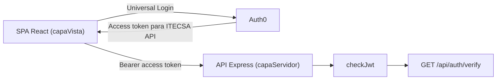

# Arquitectura - Integracion Auth0 Inicial

## Vision General

ITECSA utiliza una SPA React para la experiencia de usuario y una API Express para los controles backend. Auth0 autentica al usuario y emite el access token destinado a la API.

## Flujo De Autenticacion

1. `Auth0Provider` configura la SPA con dominio, client ID, audience de la API y URL de retorno.
2. El usuario inicia sesion mediante Universal Login; la SPA no captura ni persiste contrasenas.
3. Auth0 emite un access token destinado a la audience configurada.
4. La Action Post Login agrega claims namespaced al access token:
   - `https://itecsa.local/roles`: roles oficiales obtenidos de Auth0 Roles/RBAC.
   - `https://itecsa.local/email`: correo provisto por Auth0 para identificar la sesion en la respuesta de verificacion.
5. El backend valida el bearer token mediante `checkJwt`, comprobando issuer y audience.
6. `GET /api/auth/verify` expone identidad y rol para tokens que cumplen el contrato actual.

## Decisiones De Autorizacion

- Auth0 RBAC es la fuente de roles; el backend no confia en roles calculados por el frontend.
- La API recibe un arreglo en `https://itecsa.local/roles` y acepta exactamente un rol oficial.
- `rolUsuario` es la proyeccion singular que la API devuelve a partir del unico rol valido.
- Si el token no incluye email, no tiene un rol oficial unico o contiene multiples roles, `/api/auth/verify` responde `403`.
- Un token ausente o que no supera validacion JWT responde `401`.

## Separacion Frontend Y Backend

- `ProtectedRoute`, `RoleGuard` y `/access-denied` controlan navegacion y presentacion en la SPA.
- Esos componentes no sustituyen la autorizacion backend.
- La SPA aun no consume `/api/auth/verify` ni transforma un `403` de la API en navegacion hacia `/access-denied`.
- La proteccion efectiva de futuros endpoints administrativos debe implementarse en Express.

## Limites Vigentes

- No existe aun middleware `requireAdministrador`.
- No se implementa Auth0 Management API ni creacion administrativa de usuarios.
- No se integra Prisma ni MySQL.
- No se persisten RUT, firma electronica ni contrasenas.
- Los secretos y access tokens no deben exponerse en frontend ni registrarse en documentacion.

Para ejecutar cada capa, consultar [README raiz](../README.md), [README frontend](../capaVista/README.md) y [README backend](../capaServidor/README.md).
