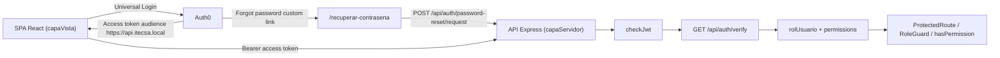
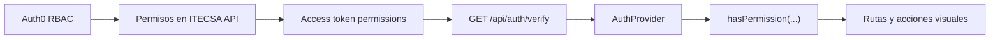

# Arquitectura - Integracion Auth0 Inicial

## Vision General

ITECSA utiliza una SPA React para la experiencia de usuario y una API Express para validar autenticacion, rol y permisos. Auth0 autentica al usuario, administra las contrasenas y emite access tokens destinados a la API ITECSA.



## Recursos Auth0

- SPA: `ITECSA Frontend Local`.
- API: `ITECSA API`, con audience `https://api.itecsa.local`.
- API `ITECSA API`: scopes declarados `view:main-navigation`, `view:kanban-module`, `view:payments-module`, `view:own-profile`, `view:orders-module`, `create:users-visually`, `manage:users-visually` y `update:payment-status`.
- M2M backend: `ITECSA Backend Management`, usada solo por Express para Auth0 Management API con token validado para `create:users`, `read:roles`, `read:users` y `update:users`.
- Action Post Login: `ITECSA Add Claims`.
- Conexion Database: `Username-Password-Authentication`.
- Roles permitidos: `Administrador`, `Gerencia`, `Producción`, `Ventas` y `Cobranzas`.

No se documentan secretos reales. Los `client_id` son identificadores publicos; el secret M2M queda fuera del repositorio y no se expone al frontend.

El tenant usa Classic Universal Login con template personalizado gratuito. El template mantiene `allowSignUp: false`, limita la conexion a `Username-Password-Authentication` y reemplaza el link nativo de recuperacion por `/recuperar-contrasena` en la SPA. Los mensajes de Lock para `unauthorized`, `lock.unauthorized`, `blocked_user` y `too_many_attempts` se personalizan para evitar una experiencia ambigua en cuentas bloqueadas.

## Flujo De Autenticacion

1. `Auth0Provider` configura la SPA con dominio, client ID, audience de la API y URL de retorno.
2. El usuario inicia sesion mediante Universal Login; la SPA no captura ni persiste contrasenas.
3. Auth0 emite un access token destinado a `https://api.itecsa.local`.
4. La Action Post Login agrega claims namespaced al access token:
   - `https://itecsa.local/roles`: roles oficiales obtenidos desde Auth0 RBAC.
   - `https://itecsa.local/email`: correo provisto por Auth0 para identificar la sesion en la respuesta de verificacion.
5. Auth0 agrega el claim estandar `permissions` cuando RBAC y `Add Permissions in the Access Token` estan activos para `ITECSA API`.
6. La SPA llama `GET /api/auth/verify` mediante `authApi.verify()` y bearer token Auth0.
7. El backend valida issuer, audience, email, rol unico permitido y formato de permisos.
8. La API devuelve `rolUsuario`, `isAdministrador` y `permissions` para que la SPA controle navegacion y experiencia visual.

Si Auth0 rechaza el inicio de sesion por cuenta `blocked`, la SPA conserva el error del SDK Auth0 React, no relanza automaticamente `loginWithRedirect()` y muestra el mensaje de cuenta desactivada. Esto evita un bucle visual de retorno al Universal Login.

## Recuperacion Publica De Contrasena

El usuario inicia la recuperacion desde el link personalizado de Classic Universal Login hacia `/recuperar-contrasena`. La SPA no consulta Auth0 directamente; envia el correo al backend mediante `POST /api/auth/password-reset/request`.

El backend aplica estas reglas:

- Si el correo no existe en la tabla interna `Usuario`, responde el mensaje de cuenta no encontrada y no llama Auth0.
- Si el usuario existe pero su `estadoUsuario` no es `Activo`, responde el mensaje de cuenta desactivada y no llama Auth0.
- Si el usuario existe y esta `Activo`, solicita a Auth0 el correo de cambio de contrasena mediante `/dbconnections/change_password`.

El flujo nunca retorna tickets, enlaces, tokens ni contrasenas a la SPA. La distincion de mensajes entre cuenta inexistente y desactivada es una decision funcional del sistema y debe mantenerse con rate limiting, logs y monitoreo para reducir enumeracion abusiva.

## Autorizacion

- La fuente vigente de roles es Auth0 RBAC.
- El backend no confia en roles calculados por el frontend.
- La API recibe un arreglo en `https://itecsa.local/roles` y acepta exactamente un rol oficial.
- `rolUsuario` es la proyeccion singular que la API devuelve a partir del unico rol valido.
- Cualquier `app_metadata.rolUsuario` heredado en usuarios existentes es auxiliar y no reemplaza RBAC ni debe usarse como fuente de autorizacion.
- `ProtectedRoute`, `RoleGuard`, `hasPermission(...)` y `/access-denied` son controles de experiencia visual.
- Toda accion sensible debe validarse en backend con `checkJwt` y un middleware o regla de autorizacion propia.

Flujo de permisos visuales:



## Creacion Administrativa De Usuarios

Los endpoints bajo `/api/admin/users` estan protegidos con `checkJwt` y rol `Administrador`. La creacion acepta `multipart/form-data` con nombre, apellido, RUT, correo, rol y firma electronica. No recibe contrasenas.

El backend usa `ITECSA Backend Management` para:

- Obtener un token M2M solo en servidor.
- Resolver el rol Auth0 RBAC existente.
- Crear el usuario en `Username-Password-Authentication`.
- Asignar el rol RBAC al usuario.
- Registrar la entidad interna `Usuario` con datos personales de negocio y ruta de firma.
- Solicitar el correo de establecimiento/cambio de contrasena mediante Auth0.

La contrasena temporal generada para la creacion Database existe solo en memoria durante la llamada a Auth0. ITECSA no recibe, almacena ni persiste contrasenas, tickets ni enlaces de cambio de contrasena.

La gestion administrativa usa la tabla interna `Usuario` para listar, resumir, editar y desvincular usuarios. Las ediciones de correo, rol y estado se sincronizan con Auth0 Management API, mientras nombre, apellido, RUT y ruta de firma siguen siendo datos internos de negocio.

## Variables De Entorno

Frontend:

```dotenv
VITE_AUTH0_DOMAIN=<tenant-auth0>
VITE_AUTH0_CLIENT_ID=<client-id-spa>
VITE_AUTH0_AUDIENCE=https://api.itecsa.local
VITE_API_BASE_URL=http://localhost:3000/api
```

Backend:

```dotenv
PORT=3000
FRONTEND_ORIGIN=http://localhost:5173
AUTH0_DOMAIN=<tenant-auth0>
AUTH0_AUDIENCE=https://api.itecsa.local
AUTH0_MANAGEMENT_CLIENT_ID=<client-id-m2m>
AUTH0_MANAGEMENT_CLIENT_SECRET=
AUTH0_DATABASE_CONNECTION=Username-Password-Authentication
AUTH0_PASSWORD_RESET_CLIENT_ID=<client-id-spa>
DB_HOST=<host-aiven>
DB_PORT=<puerto-aiven>
DB_USER=<usuario-aiven>
DB_PASSWORD=
DB_NAME=<nombre-bd>
DB_SSL_CA_PATH=./certs/aiven-ca.pem
DATABASE_URL=mysql://<usuario-aiven>:<password-aiven>@<host-aiven>:<puerto-aiven>/<nombre-bd>?sslcert=./certs/aiven-ca.pem&sslaccept=strict
```

El frontend solo usa variables `VITE_*`, que son visibles en navegador. Ninguna credencial Auth0 Management debe agregarse a `capaVista`.
Las variables `DB_*` alimentan `mysql2/promise` y el adaptador Prisma MariaDB; `DATABASE_URL` se usa por Prisma CLI para introspeccion y generacion.

## Limites Vigentes

- Prisma y MySQL estan integrados en `capaServidor` para persistir la entidad interna `Usuario` durante la creacion administrativa.
- No se persisten contrasenas. RUT y ruta de firma se persisten en la entidad interna `Usuario`.
- No se documentan tokens, contrasenas, correos reales ni secrets.
- La matriz rol-permiso funcional vive en Auth0 RBAC; si se agrega una nueva vista, se debe crear el permiso en `ITECSA API`, asignarlo al rol correspondiente y consumirlo desde `hasPermission(...)`.
- Pedidos, pagos persistidos, Kanban real y persistencia de negocio con BD quedan fuera de esta integracion inicial. El cierre backend RF32 existe con datos mock/en memoria para consultar ordenes, actualizar estado de pago y mover Kanban; la pantalla de pagos actual conserva datos locales/mock y no consume todavia el endpoint de cambio de estado.

La trazabilidad tecnica del incremento esta documentada en [TRAZABILIDAD_INCREMENTO_1.md](./TRAZABILIDAD_INCREMENTO_1.md).

Para ejecutar cada capa, consultar [README raiz](../README.md), [README frontend](../capaVista/README.md) y [README backend](../capaServidor/README.md).
