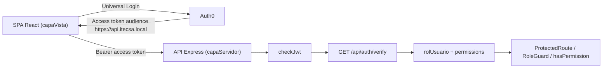
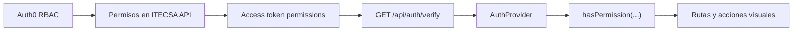

# Arquitectura - Integracion Auth0 Inicial

## Vision General

ITECSA utiliza una SPA React para la experiencia de usuario y una API Express para validar autenticacion, rol y permisos. Auth0 autentica al usuario, administra las contrasenas y emite access tokens destinados a la API ITECSA.



## Recursos Auth0

- SPA: `ITECSA Frontend Local`.
- API: `ITECSA API`, con audience `https://api.itecsa.local`.
- M2M backend: `ITECSA Backend Management`, usada solo por Express para Auth0 Management API.
- Action Post Login: `ITECSA Add Role Claim`.
- Conexion Database: `Username-Password-Authentication`.
- Roles permitidos: `Administrador`, `Gerencia`, `Operario`, `Ventas` y `Cobranzas`.

No se documentan secretos reales. Los `client_id` son identificadores publicos; el secret M2M queda fuera del repositorio y no se expone al frontend.

## Flujo De Autenticacion

1. `Auth0Provider` configura la SPA con dominio, client ID, audience de la API y URL de retorno.
2. El usuario inicia sesion mediante Universal Login; la SPA no captura ni persiste contrasenas.
3. Auth0 emite un access token destinado a `https://api.itecsa.local`.
4. La Action Post Login agrega claims namespaced al access token:
   - `https://itecsa.local/roles`: roles oficiales obtenidos desde Auth0 RBAC.
   - `https://itecsa.local/email`: correo provisto por Auth0 para identificar la sesion en la respuesta de verificacion.
5. Auth0 agrega el claim estandar `permissions` cuando RBAC y `Add Permissions in the Access Token` estan activos para `ITECSA API`.
6. La SPA llama `GET /api/auth/verify` mediante `authApi.verify()` y bearer token Auth0.
7. El backend valida issuer, audience, email, rol unico permitido y formato de permisos.
8. La API devuelve `rolUsuario`, `isAdministrador` y `permissions` para que la SPA controle navegacion y experiencia visual.

## Autorizacion

- La fuente vigente de roles es Auth0 RBAC.
- El backend no confia en roles calculados por el frontend.
- La API recibe un arreglo en `https://itecsa.local/roles` y acepta exactamente un rol oficial.
- `rolUsuario` es la proyeccion singular que la API devuelve a partir del unico rol valido.
- Cualquier `app_metadata.rolUsuario` heredado en usuarios existentes es auxiliar y no reemplaza RBAC ni debe usarse como fuente de autorizacion.
- `ProtectedRoute`, `RoleGuard`, `hasPermission(...)` y `/access-denied` son controles de experiencia visual.
- Toda accion sensible debe validarse en backend con `checkJwt` y un middleware o regla de autorizacion propia.

Flujo de permisos visuales:



## Creacion Administrativa De Usuarios

`POST /api/admin/users` esta protegido con `checkJwt` y rol `Administrador`. El endpoint acepta solo `correoUsuario` y `rolUsuario`; no recibe nombre, apellido, RUT, firma electronica ni contrasenas.

El backend usa `ITECSA Backend Management` para:

- Obtener un token M2M solo en servidor.
- Resolver el rol Auth0 RBAC existente.
- Crear el usuario en `Username-Password-Authentication`.
- Asignar el rol RBAC al usuario.
- Solicitar el correo de establecimiento/cambio de contrasena mediante Auth0.

La contrasena temporal generada para la creacion Database existe solo en memoria durante la llamada a Auth0. ITECSA no recibe, almacena ni persiste contrasenas, tickets ni enlaces de cambio de contrasena.

## Variables De Entorno

Frontend:

```dotenv
VITE_AUTH0_DOMAIN=<dominio-auth0>
VITE_AUTH0_CLIENT_ID=<client-id-spa>
VITE_AUTH0_AUDIENCE=https://api.itecsa.local
VITE_API_BASE_URL=http://localhost:3000/api
```

Backend:

```dotenv
PORT=3000
FRONTEND_ORIGIN=http://localhost:5173
AUTH0_DOMAIN=<dominio-auth0>
AUTH0_AUDIENCE=https://api.itecsa.local
AUTH0_MANAGEMENT_CLIENT_ID=<client-id-m2m>
AUTH0_MANAGEMENT_CLIENT_SECRET=
AUTH0_DATABASE_CONNECTION=Username-Password-Authentication
AUTH0_PASSWORD_RESET_CLIENT_ID=<client-id-publico-spa>
```

El frontend solo usa variables `VITE_*`, que son visibles en navegador. Ninguna credencial Auth0 Management debe agregarse a `capaVista`.

## Limites Vigentes

- No se implementa Prisma ni MySQL en esta rama.
- No se persisten RUT, firma electronica ni contrasenas.
- No se documentan tokens, contrasenas, correos reales ni secrets.
- La matriz rol-permiso funcional vive en Auth0 RBAC; si se agrega una nueva vista, se debe crear el permiso en `ITECSA API`, asignarlo al rol correspondiente y consumirlo desde `hasPermission(...)`.
- Pedidos, pagos, Kanban real y persistencia de negocio quedan fuera de esta integracion Auth0 inicial.

La trazabilidad especifica de login, creacion de usuarios e integracion Auth0 esta documentada en [TRAZABILIDAD_AUTH0.md](./TRAZABILIDAD_AUTH0.md).

Para ejecutar cada capa, consultar [README raiz](../README.md), [README frontend](../capaVista/README.md) y [README backend](../capaServidor/README.md).
