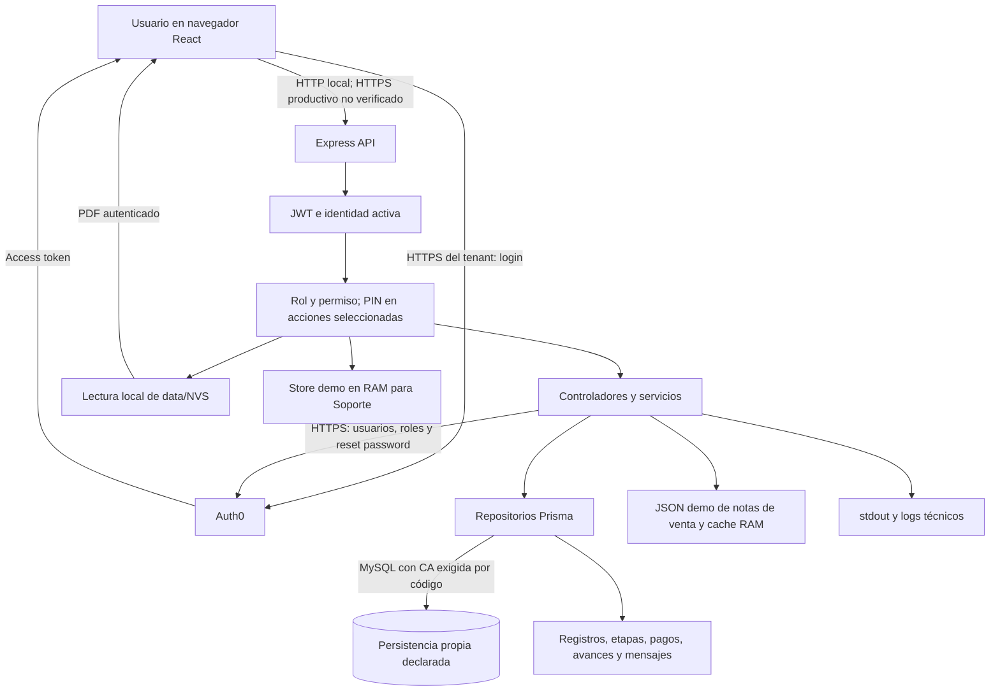
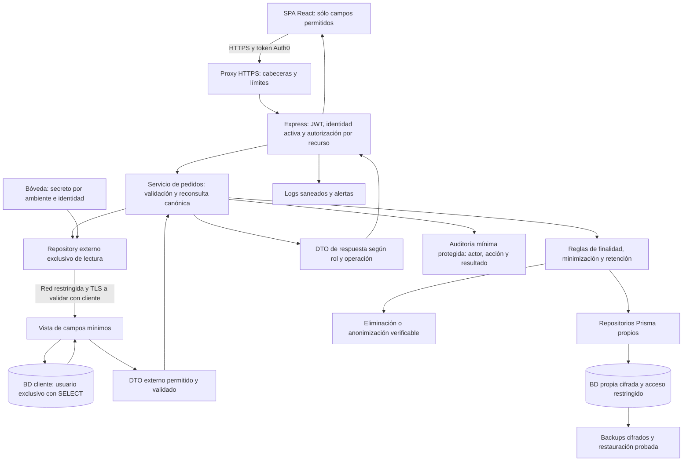

> **Informe histórico archivado.** Contexto: 25-09-2026; revisión 166593b051dfb04c8ec969f63b3a6541dcbf627f.
> Ubicación original: `AUDITORIA_PREVIA_PROTECCION_DATOS_21719.md`. El contenido y sus referencias originales se conservan como evidencia de esa revisión; no acreditan el estado actual.
> Consultar la [referencia vigente](../../PENDIENTES.md), los [pendientes](../../PENDIENTES.md) y el [índice del archivo](../README.md).

# Auditoría previa de protección de datos — Ley N.º 21.719

Fecha: 25 de septiembre de 2026. Revisión: `166593b051dfb04c8ec969f63b3a6541dcbf627f`. Modalidad: inspección técnica del repositorio y pruebas locales con datos sintéticos. **No constituye certificación jurídica ni acreditación de un despliegue productivo.**

## 1. Resumen ejecutivo

**No se recomienda recibir credenciales ni habilitar acceso a datos personales del cliente mañana con el estado actual.** Existe una base técnica aprovechable, pero hay brechas reproducibles de minimización, protección del PIN y manejo de errores, además de controles operativos cuya implementación no está acreditada. Esto no significa que cada brecha constituya por sí sola una infracción legal.

**No hay acceso a la base productiva de Marcos Vega y no se probó ni se presume esa conexión. Su ausencia no es un incumplimiento.** El adaptador Prisma del repositorio corresponde a la persistencia de la aplicación; la consulta actual de notas de venta utiliza un JSON local. No se deben confundir esos dos componentes con la integración futura.

Se registran **19 hallazgos: 0 CRÍTICOS, 7 ALTOS, 10 MEDIOS y 2 BAJOS**. Los recuentos de paquetes afectados de npm se informan por separado, sin contarlos como vulnerabilidades explotadas ni duplicar dependencias padre/hija.

Los cinco principales riesgos son:

1. Respuestas de pedidos que conservan registros internos, correos y observaciones para todos los roles con lectura de pedidos (H01–H02).
2. Soporte tiene acceso transversal sin una prohibición general de uso en producción (H03).
3. Intentos concurrentes pueden eludir el contador de PIN; la recuperación carece de límites de solicitud y el modo no productivo imprime códigos (H05–H07).
4. La creación de pedidos confía en datos de origen reenviados por el navegador, permitiendo alteración de información atribuida a la nota de venta (H09).
5. Dependencias con avisos vigentes, incluido PDF.js, más falta de evidencia operativa de transporte y almacenamiento seguros (H10, H15).

Controles favorables: JWT con issuer/audience, denegación ante identidad inactiva, permisos efectivos en backend, restricciones departamentales de administración, actor derivado de sesión/PIN, mensajes ligados al destinatario, consultas SQL parametrizadas, contraseñas delegadas a Auth0, PIN con scrypt/sal y eliminación de su copia cifrada tras aceptación. **600 tests backend pasan**; frontend pasa 86 verificaciones declaradas por su runner y 2 entradas de test adicionales. Eso no prueba TLS, permisos ni seguridad de una BD real.

Bloqueantes: cerrar H01–H03, H05, H07–H10; endurecer credenciales locales y su entrega; aprobar campos/finalidades/retención; acreditar HTTPS y protección del almacenamiento; resolver procedencia de archivos y segregación de ambientes. Antes de usar la integración, ejecutar una validación supervisada de las condiciones acordadas con el cliente.

## 2. Alcance y método

Se inventariaron los **409 archivos versionados**, los archivos de configuración locales pertinentes y **291 commits alcanzables**. Se revisaron rutas, controladores, servicios, repositorios, middleware, esquema y migraciones Prisma, React, proveedores Auth0, cliente HTTP, utilidades, mocks, archivos PDF, scripts, documentación, manifests y lockfiles. No se encontraron `AGENTS.md`, Dockerfiles, Compose ni pipelines CI/CD versionados.

La revisión combinó lectura de los flujos de seguridad, búsquedas transversales de secretos/SQL/logs/almacenamiento/errores, inventario completo de rutas, trazado de llamadas y ejecución de suites existentes. No equivale a revisión manual línea por línea de CSS o cada fixture, ni a pentest exhaustivo.

Se analizaron 1.787 blobs alcanzables por Git mediante patrones de secretos; también se compararon, sin imprimirlos, los valores locales de DB_PASSWORD, AUTH0_MANAGEMENT_CLIENT_SECRET y PIN_SECRET contra esos blobs. Se extrajo texto de los 12 PDF. Se consultaron fuentes legales oficiales, OWASP y avisos de mantenedores.

Operaciones ejecutadas: `git status`, `git ls-files`, `git log`, `git rev-list --objects --all`, lectura de blobs, `rg`, `pdftotext`, `npm audit --json --ignore-scripts`, `npm outdated --json --ignore-scripts`, `npm test` en cada capa y tres comprobaciones sintéticas descritas en §20. No se ejecutaron migraciones, seeds, scripts de reparación, llamadas a Auth0 ni consultas a ninguna BD.

## 3. Limitaciones

- No se verificaron servidores, DNS, balanceadores, certificados desplegados, ACL, discos, KMS, monitoreo, backups productivos ni configuración viva del tenant Auth0.
- Las variables locales son configuración presente, no evidencia de conexión efectiva, privilegios ni autenticidad/vigencia de una credencial. No se publican sus valores: `SECRET=[REDACTED]`.
- La revisión de Git cubre refs disponibles y objetos alcanzables; no forks, clones ajenos, refs remotas no descargadas, reflogs históricos completos ni objetos ya purgados. El escaneo por patrones no garantiza ausencia universal de secretos.
- El texto extraíble de un PDF no detecta información dibujada como imagen. Las siete firmas no tienen texto útil; no se certifica que sean ficticias.
- No se acredita que los datos modelados estén actualmente poblados en una BD. El inventario distingue capacidad de tratamiento implementada de archivos efectivamente presentes.
- Las pruebas inyectan repositorios y autenticación de prueba; no certifican validación criptográfica extremo a extremo con tokens reales.
- La consulta npm es una fotografía del 25-09-2026; versión afectada no implica automáticamente alcanzabilidad o explotación.

## 4. Marco legal y técnico

Al 25-09-2026, la reforma general de la Ley 21.719 entra en vigor el **01-12-2026**. Se evalúa preparación para ese régimen, sin atribuir anticipadamente todas sus obligaciones al sistema. La Ley 19.628 vigente contempla secreto, finalidad, diligencia y derechos de los titulares (arts. 7, 9, 11 y 12). [BCN: Ley 19.628 vigente](https://www.bcn.cl/leychile/navegar?idNorma=141599&idVersion=2012-02-17).

La reforma incorpora principios de tratamiento (art. 3), confidencialidad (14 bis), transparencia (14 ter), diseño y configuración por defecto (14 quáter), seguridad proporcional al riesgo (14 quinquies), reporte de vulneraciones (14 sexies), evaluación de impacto cuando corresponda (15 ter) y reglas para encargados y transferencias. [BCN: Ley 21.719 y disposiciones transitorias](https://www.bcn.cl/leychile/navegar?idNorma=1209272).

Se distinguen tres niveles:

| Nivel | Qué significa en este informe |
|---|---|
| Obligación legal | Deber normativo, cuya aplicabilidad concreta requiere evaluar responsable, encargado, finalidad y fecha. |
| Interpretación técnica | DTO mínimos, ACL por recurso, borrado verificable y trazabilidad como formas razonables de materializar esos deberes. |
| Buena práctica | Argon2id/scrypt ajustado, secret manager, CI, límites, aislamiento y endurecimiento; la ley no impone esos productos ni un algoritmo específico. |

La matriz de §24 califica **criterios técnicos**, no certifica cumplimiento jurídico. RBAC, hashing y TLS no sustituyen una base de licitud, instrucciones del cliente ni atención de derechos. No se exige cifrar individualmente todos los campos.

Referencias complementarias: [OWASP Password Storage](https://cheatsheetseries.owasp.org/cheatsheets/Password_Storage_Cheat_Sheet.html) y [OWASP Logging](https://cheatsheetseries.owasp.org/cheatsheets/Logging_Cheat_Sheet.html). Las recomendaciones técnicas específicas del informe son propuestas de implementación, no citas de la ley.

## 5. Arquitectura actual

- **Frontend:** SPA React/Vite, Auth0 React SDK, React Router, guards compartidos con la matriz de permisos y cliente fetch con Bearer token. `capaVista/src/app/providers/AppProviders.jsx:24-35`; `capaVista/src/services/api/apiClient.js:86-137`.
- **Backend:** Express modular con controller → service → repository. Hay DTO manuales en funciones de mapeo, no una capa contractual uniforme. Montajes en `capaServidor/src/server.js:31-113`.
- **Identidad:** Auth0 valida la identidad externa; `Usuario` registra identidad/rol/estado local y PIN. `checkJwt` verifica token y encadena identidad activa; la autorización cruza rol reconocido con permisos.
- **Persistencia propia declarada:** Prisma MySQL con adaptador MariaDB, inicialización diferida y CA requerida por código. `capaServidor/src/database/prisma.js:7-64`. No se verificó conectividad.
- **Origen actual de notas:** 60 registros de `capaServidor/data/demo/sales-notes-fixture.json`, cargados y cacheados por `salesNoteSource.service.js:86-136`. **No es un conector de BD del cliente.**
- **Documentos:** lectura autenticada desde `data/NVS`; siete PDF en `data/Firmas`. El middleware de upload y el servicio de firma sobreviven en código, pero no están conectados al alta de usuarios ni al servicio actual de pagos. La documentación describe flujos antiguos que no deben darse por vigentes.
- **Demo:** store en memoria y rutas de Soporte. No hay exclusión por NODE_ENV del montaje del router.
- **Servicios externos actuales declarados:** Auth0 Authentication/Management por HTTPS. No se encontró proveedor productivo para recuperación de PIN, SMTP implementado ni otros servicios de integración activos.

## 6. Flujo actual de datos

| Origen → destino | Protocolo / datos | ¿Personales? | Controles actuales | Riesgo |
|---|---|---|---|---|
| Navegador ↔ Auth0 | HTTPS/OIDC; correo, contraseña, tokens | Sí | SDK y tenant, redirección interna validada | Políticas, MFA, expiración y tenant desplegado no verificables |
| React ↔ Express | fetch + Bearer; perfil, RUT, pedidos, comentarios, PIN | Sí | JWT, CORS a origen configurado, RBAC | Configuración local HTTP; edge productivo desconocido; DTO amplios |
| Express → Auth0 | HTTPS; secreto M2M, usuarios, rol, correo reset | Sí y secretos | Scopes explícitos; secreto sólo servidor | Credenciales locales; ausencia de timeouts explícitos y auditoría integral |
| API → servicios → Prisma | Llamadas internas en proceso | Sí | Identidad, PIN, transacciones en operaciones de negocio | Datos de origen confiados al navegador; proyecciones excesivas |
| Prisma ↔ persistencia propia | Protocolo MySQL; entidades y registros | Sí | CA configurada; SQL tagged templates | Cifrado efectivo, host y permisos no comprobados; conector con avisos |
| JSON demo → servicio → API | Lectura filesystem, caché RAM, JSON | Potencialmente | Normalización de campos y permiso de ventas | Dirección/comuna/ciudad y texto libre sin justificación documentada |
| data/NVS → usuario | Filesystem + respuesta PDF | Potencialmente | JWT, read:orders, control de ruta | Sin vínculo documento/pedido ni permiso específico por contenido |
| Servicios → stdout | Consola; errores, sub/rol, hash de correo, código de PIN en desarrollo | Sí | Algunos mensajes reducidos | Sin redacción uniforme ni retención; código recuperable en logs |
| Operaciones → Registros | Persistencia relacional | Sí | Actor, recurso, hora y cambios en varios flujos | No cubre todos los eventos de seguridad; no evidencia de inmutabilidad |
| Scripts → data/backups | Copia local de PDF | Potencialmente | Directorio ignorado por Git, restauración parcial | Sin cifrado de aplicación, política de permisos o retención |

No se dibuja una conexión activa con la BD del cliente porque no existe evidencia de ella.

## 7. Inventario de datos personales

“Necesario” es una evaluación de finalidad aparente, pendiente de validación del dueño del proceso. Una razón social/RUT de persona jurídica no es automáticamente dato de persona natural; sí puede identificar a una persona natural comerciante. “No por sí mismo” en sensible no excluye que el contenido o contexto lo vuelva sensible.

| Campo | Entidad | Dato personal | Dato sensible | Finalidad aparente | Necesario | Persistencia | Protección actual |
|---|---|---|---|---|---|---|---|
| id_usuario, id_auth0 | Usuario | Sí, identificadores vinculables | No por sí mismos | Identidad/relaciones | Sí | BD propia declarada | JWT; proyecciones de salida excluyen PIN |
| nombre_usuario, apellido_usuario | Usuario | Sí | No por sí mismos | Identificación operacional | Sí, limitar pantallas | BD, memoria UI, historia | RBAC; administración departamental |
| correo_usuario | Usuario/Auth0 | Sí | No por sí mismo | Login/notificaciones/reset | Sí para identidad; no en toda lectura | BD/Auth0/RAM; algunos logs identificables | HTTPS Auth0; exposición en DTO de pedidos |
| rut_usuario | Usuario | Sí | No por sí mismo | Identificación administrativa | Requiere justificar frente a ID interno | BD/perfil/admin | Permisos; sin cifrado de columna identificado |
| rol_usuario, estado_usuario | Usuario | Sí, asociados a empleado | No por sí mismos | Autorización | Sí | BD/Auth0/token | Backend valida estado y rol |
| pin_hash, pin_salt, pin_fingerprint | Usuario | Vinculados a persona y credenciales | No automáticamente categoría legal sensible | Verificar PIN y unicidad | Hash/sal sí; unicidad global a reconsiderar | BD | scrypt + HMAC; no salen en DTO de usuario |
| pin_pending_ciphertext, iv, tag | Usuario | Credencial personal recuperable temporalmente | No automáticamente | Entrega inicial de PIN | Evitable; sólo transición justificada | BD hasta acknowledge, sin TTL | AES-256-GCM; clave derivada; no-store al revelar |
| pin_failed_attempts, pin_locked_until, pin_accepted_at | Usuario | Sí, actividad de seguridad | No por sí mismos | Antiabuso | Sí, con retención | BD | Contador no atómico; bloqueo temporal |
| code_hash, code_salt, expires_at, used_at, delivery_status | PinRecoveryChallenge | Sí, vinculados a usuario | No automáticamente | Recuperación | Durante vigencia/investigación definida | BD; código claro en stdout dev | scrypt; 15 min; 5 intentos por reto, sin limpieza |
| rut_cliente, nombre_cliente, razon_social | Cliente | Si identifican persona natural | No por sí mismos | Asociar pedido/cliente | ID/nombre operativo; RUT depende de proceso | BD + JSON demo + API | RBAC; falta proyección por rol |
| direccion/dir, comuna, ciudad | Nota de venta normalizada | Si localizan persona | No automáticamente | Posible despacho | No justificados en flujo productivo observado | JSON demo, caché RAM y respuesta API; no columnas Cliente | Permiso ventas; no minimización específica |
| usuario_manager_origen / usuarioOrigenManager | Pedidos / nota | Sí si identifica trabajador | No por sí mismo | Origen del pedido | Evaluar ID seudónimo | JSON, BD, API | Confiado al cliente HTTP en creación |
| numero_nota_venta, id_pedido, fechas, pago | Pedidos/Registro_Pago | Sí cuando vinculados a personas | No automáticamente; revisar inferencias socioeconómicas | Ejecución y trazabilidad | Sí con acceso contextual | BD, API, PDF demo | RBAC y transacciones; lectura común amplia |
| observacion, observacion_origen, observacion_interna | Pedidos/Registros/Registro_Pago | Potencialmente | Según contenido, no presumir | Contexto operacional | Limitar a lo imprescindible | BD, API, mensajes derivados | Validaciones parciales; sin clasificación/redacción |
| comentario, especificaciones, leyenda | Comentario_Produccion/Dise_o/Dise_o_Lanyard | Potencialmente | Según contenido | Producción/personalización | Según producto | Campos modelados; población/uso completo no probados | FK; sin política de contenido |
| id_usuario_registra, observacion, fechas y cantidades | Avance_Lanyard | Sí, actividad laboral | No por sí mismos | Control de producción | Sí, proporcional | BD y vistas de avance | Actor autenticado y permisos |
| id_usuario_asigna, fecha_asignacion | Pedido_Etiqueta | Sí | No | Trazabilidad | Sí | BD | Actor resuelto por backend |
| contenido, Asunto, leido?, oculto?, destinatario | Mensaje/MENSAJE_USUARIO | Sí/potencialmente | Según texto | Avisos de trabajo | Sí, limitar contenido | BD; memoria UI | Filtro por destinatario; ocultar no elimina |
| sellerCompliance, seller, flowTime | Métricas derivadas | Sí, desempeño de trabajador | No automáticamente | Gestión operacional | Requiere finalidad aprobada | Cálculo en RAM/respuesta | Sólo permisos de métricas; identificación por nombre/correo |
| Firmas PDF / contenido gráfico | data/Firmas | Potencialmente | Una firma gráfica no es automáticamente biometría; evaluar uso | Legado de firma | No demostrado en flujo actual | 7 PDF en Git y filesystem | Procedencia no acreditada; no endpoint actual de descarga de firmas |
| Contenido de notas PDF | data/NVS | Potencialmente | Depende del contenido | Vista documental demo | No incorporar originales sin aprobar | 5 PDF versionados | JWT y límite de ruta, acceso común |
| IP + email | Rate limiter de recuperación | Sí | No por sí mismos | Antiabuso | Temporalmente | Map RAM sin purga de claves | Límite compuesto débil |
| emailHash, auth0UserId, rol, errores | Logs | Sí/seudónimos vinculables | Depende del mensaje | Diagnóstico/seguridad | Minimizar | stdout; destino final desconocido | SHA-256 del correo sin clave no anonimiza |
| Password y password temporal | Auth0 / memoria backend | Credenciales de persona | No automáticamente | Autenticación/aprovisionamiento | Sí para proceso | No columna password local; Auth0 externo | Password temporal aleatorio; almacenamiento del tenant no verificable |
| Teléfono | No hay columna dedicada encontrada | No tratamiento estructurado probado | — | Podría llegar por PDF/texto libre | No importar por defecto | Sólo potencial | Pendiente clasificar contenido futuro |

Fuentes: `capaServidor/prisma/schema.prisma:9-29,52-80,110-139,164-175,187-211,238-339`; `salesNoteSource.service.js:20-28,63-83`; `metrics.service.js:26-71,74-118`; `auth.routes.js:20-26`; `auth.controller.js:53-61` (rutas completas de estos módulos en las secciones siguientes).

## 8. Gestión de secretos

**Presente:** `.gitignore:1-18` excluye `.env*`, certificados locales y node_modules; los ejemplos contienen placeholders; Vite sólo declara domain/client ID/audience/base URL públicos. No se confundieron esos identificadores públicos con secretos.

**Brecha local:** `capaServidor/.env` contiene secretos de backend en líneas 6, 14, 15 y URL con credenciales en 17; permisos POSIX observados **0644**. Esto permite lectura a otros usuarios locales si pueden atravesar los directorios; ACL/aislamiento del host no verificados. Sólo se informa `SECRET=[REDACTED]`. No se modificaron permisos. El `.env` frontend también es 0644, pero sus cuatro claves declaradas no son secretos de servidor.

**Historia:** ningún archivo `.env`, clave `.key/.p12/.pfx` o certificado `.pem` apareció en los nombres históricos buscados. Ninguno de los tres secretos locales comparados apareció en blobs alcanzables. Los 14 candidatos por patrón se clasificaron como cuatro referencias de documentación y diez asignaciones en dos versiones del mock histórico `capaVista/src/modules/auth/mocks/authCredentials.js:12,17,22,27,32` (blobs `033ff8fcdfcd`, `b66e3c432866`). Son credenciales hardcodeadas del mock; no se validó reutilización en cuentas reales. No se demuestra una credencial productiva filtrada.

Si alguna credencial histórica fue real o reutilizada: **retirarla, rotarla, revisar historial y tratar la anterior como comprometida**. Borrar Git no revoca una clave. No se probó ninguna credencial.

Objetivo: secret manager con identidades por ambiente, acceso mínimo y auditoría; variables inyectadas al proceso como interfaz, no como bóveda; CI/CD secrets sólo en jobs autorizados y nunca en artefactos; Docker secrets si se adopta ese despliegue; `.env` local fuera de Git con permisos restrictivos. Prohibir chat/correo común, hardcoding, Git, frontend y logs como canales de entrega. Inventariar PIN_SECRET y procedimiento de rotación considerando hashes, fingerprints y PIN pendientes.

## 9. Autenticación

`checkJwt.js:6-15` configura `express-oauth2-jwt-bearer` con audience e issuer HTTPS. `requireActiveIdentity.js:9-39` requiere sub, rol único reconocido, array de permisos, usuario local activo y sincronización condicionada de rol. Falla cerrado con 403/503. No se encontró bypass de JWT activado por un flag de desarrollo en ese middleware.

El SDK React solicita access tokens para esta API; no se encontró almacenamiento explícito del token en localStorage/sessionStorage en el código de aplicación. `AuthProvider.jsx` verifica la sesión por backend. Tokens en memoria no evitan una acción maliciosa ejecutada dentro del mismo origen.

No se verificaron MFA, política de password, expiración/revocación, sesiones, dominios/callbacks permitidos, protección contra ataques ni scopes realmente otorgados a M2M. La eliminación de permisos en Auth0 con mismo rol puede esperar al vencimiento/renovación del token: el middleware no consulta permisos vivos por cada request. Definir revocación acorde al riesgo, sin afirmar un bypass demostrado.

La recuperación pública de password responde `not_registered`, `disabled` o `sent`: permite enumerar cuentas. El Map de limitación usa IP+correo; variar correo crea otra cuota y conserva claves. Ver H04. La contraseña anterior no se muestra y su reset se delega a Auth0.

## 10. Autorización

**Sí existe autorización efectiva en backend.** `shared/authorization.js:23-41` limita por rol y claim de permisos; `requireCapability.js:3-10` deniega si no coinciden. CORS y guards UI no son la barrera de seguridad. `manageableRoles` limita administración por departamento; Soporte constituye excepción transversal.

Abreviaciones: AP = Administrador Producción; AV = Administrador Ventas; AC = Administrador Cobranzas; OP/OV/OC = Operarios respectivos; G = Gerencia; S = Soporte; Todos = siete roles funcionales + S, siempre con permiso requerido. Todos los prefijos siguientes son `/api`.

| Acción/API | Rol permitido | Validación frontend | Validación backend | Riesgo |
|---|---|---|---|---|
| GET auth/profile, auth/verify; POST auth/pin/reveal, acknowledge, pin-recovery/request, confirm | Todos, identidad propia | Sesión/perfil | JWT + estado + own-profile/own-pin + sub | Recuperación y concurrencia H05–H07 |
| POST auth/pin/debug-reset | S, sólo development | UI técnica | Rol, permiso, estado y NODE_ENV exacto | Control favorable; no extrapolarlo al resto de S |
| POST auth/password-reset/request | Público | Formato correo | Validación de campos y cuota IP+correo | Enumeración H04 |
| GET orders, orders/kanban, orders/:orderId | Todos | Guard read:orders | read:orders | Lectura transversal y DTO amplio H01 |
| GET orders/sales-notes/:numeroNota | AV, OV, S | Flujo crear pedido | read:sales-notes | Campos de dirección/origen excesivos |
| POST orders | AV, OV, S | Guard/create flow | create:orders, actor desde sub | Payload de origen manipulable H09 |
| GET orders/payments; payment-status y /:id | AC, OC, S | Módulo pagos | read:payments | Proyección mejor, errores crudos |
| PATCH orders/:id/payment-status | AC, OC, S | Capacidad/acción/PIN | update:payment-status + PIN; revisión adicional según transición | Reglas en servicio, contador PIN H05 |
| PATCH orders/:id/move | AP, OP, S | Acciones por capacidad | move:orders + PIN; start:production al entrar a producción | Favorable; reglas por estado |
| PATCH orders/:id/review | AP, S | Acción condicionada | review:orders | Sin PIN requerido aquí; decisión de política |
| PATCH orders/:id/cancel-production | AP, S | Acción/PIN | cancel:orders + PIN | Favorable |
| PATCH orders/:id/reevaluate | AV, OV, S | Acción por ventas | reevaluate:orders | Reconsulta fuente demo en backend |
| PATCH orders/:id/labels | AP, S | Acción por capacidad | manage:order-tags | Favorable |
| PATCH orders/:id/delivery-date | AP, S | Calendario/acción/PIN | update:order-delivery-date + PIN | Favorable |
| PATCH orders/:id/details/:d/subprocesses/:s/complete | AP, OP, S | Acción/PIN | update:production-subprocesses + PIN y vínculo al pedido | Favorable |
| PATCH equivalente /rollback | AP, S | Acción/PIN | rollback:production-subprocesses + PIN | Favorable |
| GET orders/:id/details y /:detailId | Todos | Detalle pedido | read:orders; filtro conjunto pedido/detalle | Sin IDOR cruzado demostrado |
| GET order-details y /:detailId (alias raíz) | Todos | Sin flujo independiente observado | read:orders; servicio exige orderId que no aporta esta ruta | Alias disfuncional; no omisión de autenticación |
| GET orders/:id/payment-records y /:recordId | Todos | Vista historial | read:orders; filtro conjunto pedido/registro | Permiso más amplio que pagos H02 |
| GET orders/:id/payment-records/preview | AC, OC, S | Vista pagos | read:payments | Incluye correo vendedor; justificar |
| GET history/orders y /:orderId | Todos | Guard read:orders | read:orders | Datos históricos transversales |
| GET clients/:id y /rut/:rut | AV, OV, S | Consulta en ventas | read:sales-notes | RUT en URL; sin alcance por cartera |
| GET products, /name/:name, /:id; GET order-status | Todos | Flujos pedidos | read:orders | Catálogos; no datos personales por sí mismos |
| POST clients, products, order-status, payment-status, order-details y payment-records | Ninguno | No flujo autorizado | JWT seguido de 403 | Rutas internas bloqueadas, no hallazgo de escritura libre |
| GET documents/nvs/:filename | Todos | Descarga autorizada por Bearer | read:orders + filename seguro | Falta autorización documental contextual H02 |
| GET messages, /notifications, /:id; PATCH /notifications, /notifications/:id, /:id/read | Todos, propios | Guard mensajes | own-messages y clave usuario/mensaje | Control por objeto favorable |
| GET admin/users, /summary, /:userId/movements; POST /users, /password-setup-email | AP, AV, AC, S según departamento | Guards administrativos | manage:users + manageableRoles/canManageUser | S transversal H03 |
| PATCH admin/users/:userId y /:userId/status | AP, AV, AC, S según departamento | Modal/PIN | manage:users + alcance + PIN; controles de autoedición | No escalada arbitraria de rol demostrada |
| GET production-capacity; GET production-load/today | Todos | Kanban/calendario | read:production-capacity | Datos operativos |
| PATCH production-capacity; PATCH production-load/today | AP, S | Acciones por capacidad | manage:production-capacity o manage:production-load | Falta auditoría completa |
| GET metrics/summary | AP, G, S | UI restringida AP/G | view:metrics | S puede usar API aunque UI no muestre módulo; métricas laborales |
| GET health/db | Público | No aplica | Sin JWT; error genérico | Sondeo de persistencia H18 |

Evidencia: todos los `capaServidor/src/modules/*/routes/*.js`, montajes `server.js:86-113`, `shared/authorization.js:23-55`, `adminUsers.controller.js:140-315,336-351,485-499`, `message.repo.js:145-201`, `orderDetail.service.js:40-57`, `paymentRecord.service.js:94-119`.

La aplicación no modela tenants ni una cartera por usuario. No se exige segregación inexistente como requisito inventado; **se debe acordar qué datos puede ver cada departamento**. Hoy read:orders concede lectura global y es incompatible con asumir que ocultar una pestaña de pagos protege todos sus registros.

## 11. APIs y minimización

`orders.repo.js:236-282` desestructura ciertas relaciones y luego usa `...orderFields`. **Registros no se extrae**, por lo que vuelve al cliente como objeto anidado junto con `Usuario.nombre_usuario`, `apellido_usuario` y `correo_usuario` seleccionados en `:338-350`. También quedan observaciones y usuario de origen. La transformación genera además `comments/commentGroups`, duplicando información. Se reprodujo con un repositorio falso sin BD.

`getAllOrders():398-404` no tiene paginación ni filtro por actor. `Cliente` y detalles se consultan completos en varios repositorios; registros de pago incluyen `Registros: true`. Los DTO de usuario sí excluyen hashes, ciphertext, fingerprints y sales, aunque la consulta ORM interna recupere todas sus columnas. **No se encontró salida de pin_hash o pin_salt en las respuestas actuales revisadas.**

No se encontró `SELECT *` ni `$queryRawUnsafe`/`$executeRawUnsafe` en el backend actual. Los tagged templates parametrizan valores; esto no compensa selección excesiva en ORM. `salesNoteSource.service.js:20-28` entrega dirección/comuna/ciudad que el formulario productivo observado no necesita mostrar.

No deben salir por defecto: hashes/sales/ciphertext/fingerprint, códigos OTP, secretos, rutas internas, payloads Auth0 completos, `Registros` ORM sin DTO, correo del actor cuando basta nombre/ID, RUT o domicilio sin finalidad específica. Proponer DTO separados de Kanban, pagos, historia, perfil y fuente externa, con lista permitida de campos, paginación y tests negativos de propiedades.

## 12. Datos en tránsito

El servidor llama `app.listen` y no configura TLS; los env locales/exemplos usan HTTP localhost. **Esto describe desarrollo, no demuestra HTTP en producción.** No hay proxy/Ingress/HSTS/CSP versionado para acreditar el perímetro. `apiClient.js:18-35,93-111` acepta el protocolo configurado y adjunta token/PIN. Antes de exponer información real: endpoint público HTTPS, certificado válido, rechazo/redirección segura de HTTP, canal privado protegido entre proxy/backend y evidencia de configuración del proxy. Validar trust proxy sólo para saltos conocidos al introducir rate limiting.

Auth0 utiliza URLs HTTPS en `checkJwt.js:11` y `auth0Management.service.js:127,182`; no se encontraron opciones que deshabiliten validación de certificados. No se probó el TLS desplegado ni el tenant. La plantilla `docs/auth0/universal-login.html:59` mantiene reset a localhost: requiere configuración antes de publicación.

La plantilla de login también carga JavaScript de cdn.auth0.com y cdnjs.cloudflare.com (`docs/auth0/universal-login.html:36-44`) y un logo remoto (`:122`). Son recursos web de terceros, no un conector de pedidos: el navegador puede transmitir IP/metadatos al cargarlos. Su publicación real no se verificó. Inventariar proveedores, fijar versiones y revisar CSP/integridad y necesidad de scripts legados antes de desplegar la plantilla; el npm audit no cubre estos recursos CDN. `useAuthorizedFile.js:5-17` sólo adjunta Bearer al mismo origen de la API y al prefijo documental permitido, control favorable frente a envío de tokens a URLs externas.

La persistencia propia exige CA (`database/prisma.js:39-52`); no se certifica negociación ni hostname reales. No hay microservicios HTTP internos adicionales encontrados: controller/service/repository operan dentro del mismo proceso.

**Requisito futuro, estado PENDIENTE DE INTEGRACIÓN:** La conexión con la base de datos del cliente deberá utilizar transporte cifrado cuando el motor y la infraestructura lo permitan, y su configuración deberá validarse antes de producción. **PENDIENTE DE VALIDAR CON EL CLIENTE.** No se emite juicio de cumplimiento de esa conexión todavía. Si existen limitaciones del motor, acordar una alternativa de transporte privado cifrado y evaluar el riesgo antes de habilitarla.

## 13. Datos en reposo

| Capa | Evidencia | Evaluación |
|---|---|---|
| BD propia | Campos relacionales con texto; Prisma | No hay cifrado de columnas salvo PIN pendiente; cifrado del motor/disco no verificable |
| Filesystem | data/NVS, data/Firmas, fixture JSON | Archivos legibles por la aplicación; permisos productivos y cifrado de volumen desconocidos |
| RAM backend | Caché de notas, store demo, Map recuperación | Sin persistencia externa identificada; notas permanecen hasta cambio de archivo/proceso |
| Navegador | Estado React, Map de previews/movimientos, blobs | Sin sessionStorage/localStorage activo de pedidos encontrado; documentación está desactualizada |
| Logs | stdout/console | Retención, destino y cifrado no verificados |
| Backups | Scripts copyFile a data/backups | Copias sin cifrado de aplicación; no equivalen a respaldo productivo |
| Git | PDFs y JSON versionados | Replicación histórica; cifrado de disco no restringe a colaboradores que acceden al repo |

Cifrado de disco protege un soporte apagado/robado; cifrado de volumen protege ese almacenamiento; cifrado del motor depende del proveedor y llaves; backups necesitan cifrado y control propios. El cifrado de columnas se decide por amenaza y necesidad de consultas. **Hashing no es cifrado ni anonimización de toda la base.** Cifrar no reemplaza permisos ni minimización. Priorizar protección de volumen/BD/backups y gestión separada de claves; evaluar campos especiales según clasificación del dato.

## 14. Password y PIN

Las contraseñas se administran en Auth0. El backend genera una contraseña temporal con 32 bytes aleatorios, no la guarda en Prisma y solicita establecimiento de contraseña por correo. El algoritmo y configuración del tenant son **NO VERIFICABLES** desde este repositorio.

El PIN es aleatorio de seis dígitos. Hay scrypt N=16384, r=8, p=1, sal de 16 bytes, comparación timingSafeEqual y fingerprint HMAC-SHA256 con clave derivada por HKDF. No se observó MD5/SHA-1 ni password/PIN permanente en texto plano en el esquema actual. SHA-256 para hash de correo y HMAC no son el hash de verificación del PIN.

La copia de entrega usa AES-256-GCM y sólo puede revelarse antes de aceptar; acknowledge borra ciphertext/IV/tag. **No hay recuperación del PIN antiguo ya aceptado:** confirmRecovery genera uno nuevo. Sí hay almacenamiento reversible del PIN pendiente, sin vencimiento propio ni fecha de creación dedicada; minimizar esa ventana o adoptar establecimiento/restablecimiento sin recuperabilidad.

Problemas: contador lectura→escritura no atómico; confirmación de retos tampoco hace consumo condicional exclusivo; requestRecovery no limita frecuencia y crea un reto nuevo por solicitud. El proveedor productivo no está implementado y responde indisponibilidad. NODE_ENV distinto de production selecciona un proveedor que imprime correo/código. PIN_SECRET exige 32 bytes, pero no existe esquema versionado de claves ni rotación.

Como buena práctica, medir y endurecer scrypt o migrar a Argon2id. Los parámetros actuales son inferiores a las opciones mínimas de coste publicadas por OWASP (p.ej. scrypt N=2^17,r=8,p=1; Argon2id 19 MiB,t=2,p=1). Bcrypt es alternativa para sistemas legados, no una mejora automática sobre scrypt. Un PIN de seis dígitos requiere límites y defensa adicional incluso con hashing costoso. [OWASP: almacenamiento de contraseñas](https://cheatsheetseries.owasp.org/cheatsheets/Password_Storage_Cheat_Sheet.html).

## 15. Logging

Hallazgo efectivo: `pinDelivery.service.js:15-25` imprime destinatario, código y vencimiento fuera de production. `pin.service.js:40-43` adopta ese modo cuando NODE_ENV no está definido. Ni `app.js:6-11` ni env.example exigen NODE_ENV.

Otros casos: `auth.controller.js:57-61` guarda SHA-256 de correo y estado; `:115-119` sub y rol. Un hash sin clave de un correo predecible sigue siendo vinculable. `clients.repo.js:33-35,44-46,64-66` intenta imprimir objetos de error; varios retornos de promesas sin await hacen que esos catch no capturen rechazos asíncronos y éstos asciendan al controlador. `clients.service.js:8-23` imprime RUT/nombre en createClient, **pero ese método no se usa en el actual flujo findOrCreateClient y el POST directo está bloqueado**: riesgo latente, no se afirma fuga en cada alta de pedido. Los console.error frontend reciben ApiClientError con payload de respuesta, pudiendo repetir mensajes internos.

Política propuesta: lista permitida {event, requestId aleatorio, actorId interno, action, resourceId, timestamp, outcome, safeErrorCode}. Prohibir Authorization, cookies, JWT, PIN/OTP, password, secreto M2M, connection strings, bodies completos, PDFs y pedidos completos. Omitir RUT/teléfono/domicilio; si una operación exige correlación de correo, usar HMAC con clave separada o identificador interno. Truncar entradas, neutralizar saltos de línea, proteger lectura, centralizar alertas y acordar retención. No registrar datos adicionales sólo para “tener más auditoría”. [OWASP Logging](https://cheatsheetseries.owasp.org/cheatsheets/Logging_Cheat_Sheet.html).

## 16. Manejo de errores

Numerosos controladores envían `error.message` en 500 (pedidos, pagos, clientes, mensajes, historia, métricas, capacidad y carga). Se reprodujo con mensaje interno sintético que llega intacto al JSON. Un error ORM puede contener tablas, detalles de validación o rutas; la exposición de datos/SQL depende del error concreto. **No se afirma que todos los errores revelen secretos ni que se devuelva stack explícito en todas las APIs.**

No hay middleware global de error propio en `server.js`; errores no capturados/JWT/parseo dependen del manejador Express y NODE_ENV. Si producción no fija dicho entorno, existe riesgo adicional de detalles del manejador por defecto. Auth y administración presentan mayor normalización; health/db sólo reporta mensaje genérico y code/name en log.

Corregir con errores de negocio tipados y permitidos, 500 genérico más requestId, redacción de logs y pruebas con errores Prisma/Auth0/JSON/PDF. No usar err.message crudo por considerarlo “interno”.

## 17. Trazabilidad y auditoría

Hay auditoría de negocio: `Registros` contiene usuario, pedido, fecha y observación; se enlaza con etapas, pagos y subprocesos; Avance_Lanyard agrega autor/fechas. Cambios de estado relevantes se realizan en transacciones (`order.service.js:132-167,638-696`; `orders.repo.js:590-672,1145-1166`). El actor se deriva de JWT/PIN, no de un email enviado libremente.

| Pregunta | Respuesta |
|---|---|
| ¿Quién? | Sí en registros de negocio, mediante id_usuario; el nombre actual puede cambiar |
| ¿Qué? | Inferible de tablas relacionadas/transición; no hay catálogo homogéneo de eventos |
| ¿Sobre qué? | Pedido/detalle; administración de identidades no queda cubierta por ese modelo |
| ¿Cuándo? | FECHA_HORA y fechas de evento; reloj/UTC productivos no verificados |
| ¿Resultado? | Se conservan principalmente éxitos; fallos, denegaciones, accesos y recuperación no tienen auditoría uniforme |
| ¿Es resistente a alteración? | No hay evidencia de repositorio append-only, permisos separados o controles de integridad |

No confundir logs de consola con auditoría de negocio. Proponer eventos para altas/bajas/cambios de rol, resets, importaciones y denegaciones importantes, sin cuerpos completos ni copia del dato personal anterior. Separar acceso de lectura/retención de auditoría y verificar que el operador ordinario no pueda alterarla. Definir si métricas por vendedor son compatibles con la finalidad laboral aprobada.

## 18. Retención, eliminación y derechos

**REQUIERE DEFINICIÓN ORGANIZACIONAL** para usuarios desvinculados, clientes, pedidos, métricas personales, comentarios, documentos, auditoría, logs, snapshots, respaldos y caché. No se inventan plazos.

Existen vencimientos de 15 minutos para retos y bloqueo PIN; no equivalen a limpieza de filas. El Map de recuperación no elimina claves vencidas. La caché de notas invalida por mtime/tamaño, no por política temporal. Ocultar notificaciones y desvincular usuarios no suprime datos. No se encontró proceso transversal de borrado/anonimización ni procedimiento documentado para solicitudes de titulares.

Definir por categoría: finalidad/base, responsable, plazo o evento de término, excepción de conservación, eliminación/anonimización, tratamiento de FK, propagación a Auth0/documentos/cachés/backups y evidencia de ejecución. Seudonimizar conserva condición de dato personal; anonimizar debe resistir reidentificación razonable. Implementar canal y procedimiento de derechos con verificación de identidad proporcionada; una API pública de borrado no es obligatoria ni deseable por sí sola.

## 19. Backups

`repair-payment-demo-state.js:161-195` y `reset-payment-demo-state.js:220-255` copian PDFs a data/backups y pueden restaurarlos ante error. Son respaldos auxiliares de scripts, sin cifrado explícito, retención o política de acceso. No son prueba de estrategia de recuperación de BD. La exclusión `.gitignore:33` sólo evita versionar nuevos archivos.

**Backups productivos, cifrado, ubicación/región, IAM, frecuencia, retención, RPO/RTO y pruebas reales de restauración: NO VERIFICABLE DESDE EL REPOSITORIO.** RPO/RTO y retención: REQUIERE DEFINICIÓN ORGANIZACIONAL. Solicitar evidencia y ensayo con datos sintéticos; incluir exclusión de llaves en copias y no reactivar datos suprimidos al restaurar.

## 20. Desarrollo/testing y evidencia experimental

Hay 60 notas en JSON demo y múltiples mocks/test fixtures; el rótulo demo no demuestra por sí mismo anonimización. Los cinco PDF de NVS contienen texto con marca demo/dummy/prueba y cifras compatibles con RUT; no se valida que todos sus identificadores sean ficticios. Los siete PDF de firmas no ofrecen texto extraíble útil. No se encontró dump productivo SQL versionado: los seis SQL observados son migraciones. Tampoco se encontró CSV versionado. No se contactó a personas ni se validaron identidades de fixtures.

No hay evidencia completa de ambientes segregados. Soporte y demo están montados sin exclusión productiva. Los scripts administrativos cargan `.env`; deben quedar fuera de la imagen/runtime productivo y usar una identidad distinta de la aplicación. Algunos aún referencian `documento`/`nota_Venta`, modelos ausentes del esquema actual. No se ejecutaron.

### Validación realizada

| Comprobación | Resultado | Límite |
|---|---|---|
| Backend npm test | 600/600 tests, 0 fallos, 0 omitidos | Dobles de datos/identidad; no tenant/BD real |
| Frontend npm test | Runner: 5 perfil + 76 autorización + 5 pagos; node --test: 2 entradas exitosas | Pruebas locales, no navegador productivo/E2E |
| Primera ejecución backend en sandbox | 26 entradas de archivo pasan, 11 fallan por sockets; test documental directo confirma listen EPERM | Restricción ambiental resuelta al repetir con autorización; no fallo del producto |
| DTO de pedido con repositorio falso | Registros.Usuario.correo_usuario y observacion_interna sobreviven al mapper | Datos inventados; demuestra contrato de salida, no volumen real |
| Controlador GET pedido con service falso que arroja error | Respuesta 500 conserva el mensaje interno sintético | Sin ataques ni fallos inducidos en infraestructura |
| PIN con seis validaciones incorrectas concurrentes sobre snapshots simulados | Todas rechazan PIN, pero contador final=1 y sin bloqueo | Demuestra pérdida de actualizaciones en lógica; no carga contra BD real |
| Escaneo de Git | 1.787 blobs, 14 candidatos revisados; 0 coincidencias exactas de tres secretos locales | No escáner comercial ni garantía de ausencia |
| npm audit/outdated | Ejecutados tras habilitar consulta al registro público | No instalación/actualización/fix |

Los probes importaron el código real e inyectaron respuestas sintéticas: no se añadieron tests al repositorio ni se cambiaron archivos de aplicación. Las suites existentes pueden crear y limpiar archivos temporales de prueba. `git status` fue limpio antes y tras las pruebas, previo a crear este informe.

Faltan pruebas de contratos de campos prohibidos, contadores concurrentes/OTP de un solo uso, política documental por rol, importación alterada, expiración de pendientes, error redaction, exclusión de Soporte productivo y controles de despliegue. Pruebas JWT con tokens inválidos/issuer/audience/expiración deben cubrir el middleware real, además de los fixtures de autenticación usados por rutas.

## 21. Docker e infraestructura

**NO APLICA** la inspección de una imagen Docker/Compose existente: no hay archivos Dockerfile/Compose versionados. No se puede afirmar que procesos productivos corran como root, ni qué puertos o volúmenes se publican. **NO VERIFICABLE** el despliegue real, incluido si Docker se usa fuera del repo. No se encontró configuración de pipeline en el árbol versionado.

Si se adopta Docker: usuario no root, imagen Node soportada fijada por digest, build multietapa, dependencias necesarias, filesystem de sólo lectura con mounts explícitos, límites, backend no expuesto directamente a Internet, secretos montados/injectados en runtime y exclusión de `.env`, `.git`, PDFs y backups del contexto. La falta actual de `.dockerignore` no prueba que un secreto se haya copiado a una imagen inexistente.

Exigir configuración revisable de proxy HTTPS, cabeceras, identidades de servicio, red y almacenamiento. El proceso local usa Node v24.20.0; Node 24 pertenece a la línea LTS, pero la versión desplegada no está fijada en engines/.nvmrc ni Docker. [Calendario oficial Node.js](https://nodejs.org/en/about/previous-releases).

## 22. Dependencias

Se auditó cada lockfile de aplicación, no el lockfile vacío de la raíz. Npm reporta **backend: 9 nodos afectados (7 altos, 2 moderados); frontend: 3 (2 altos, 1 moderado)**. Cero críticos en esas respuestas. Un nodo puede heredar la severidad de una dependencia y varios avisos afectar al mismo paquete.

| Capa | Paquete fijado | Severidad npm | Alcance / origen del aviso |
|---|---|---|---|
| backend | @prisma/adapter-mariadb 7.8.0 | moderate | dependencia de aplicación; alcanzabilidad a evaluar; mariadb |
| backend | @prisma/config 7.9.1 | high | toolchain; deepmerge-ts |
| backend | deepmerge-ts 7.1.5 | high | toolchain; [GHSA-ggr8-5vv4-36mx](https://github.com/advisories/GHSA-ggr8-5vv4-36mx) |
| backend | fast-uri 3.1.5 | high | dependencia de aplicación; alcanzabilidad a evaluar; [GHSA-5jgf-p345-68v8](https://github.com/advisories/GHSA-5jgf-p345-68v8), [GHSA-f65p-4m7j-42xc](https://github.com/advisories/GHSA-f65p-4m7j-42xc), [GHSA-fph4-wmhf-6fwf](https://github.com/advisories/GHSA-fph4-wmhf-6fwf), [GHSA-jqff-g426-hqxp](https://github.com/advisories/GHSA-jqff-g426-hqxp) |
| backend | mariadb 3.4.5 | high | dependencia de aplicación; alcanzabilidad a evaluar; [GHSA-cqhc-2h57-wpxf](https://github.com/advisories/GHSA-cqhc-2h57-wpxf), [GHSA-42r5-vhpq-m858](https://github.com/advisories/GHSA-42r5-vhpq-m858), [GHSA-g5xc-5w98-jfvm](https://github.com/advisories/GHSA-g5xc-5w98-jfvm) |
| backend | multer 2.2.0 | high | dependencia de aplicación; alcanzabilidad a evaluar; [GHSA-wc9g-mqfw-jrwm](https://github.com/advisories/GHSA-wc9g-mqfw-jrwm), [GHSA-qfvm-cv95-jqjf](https://github.com/advisories/GHSA-qfvm-cv95-jqjf), [GHSA-qvfw-j98x-7q72](https://github.com/advisories/GHSA-qvfw-j98x-7q72), [GHSA-535w-7cp7-47q4](https://github.com/advisories/GHSA-535w-7cp7-47q4) |
| backend | mysql2 3.15.3 | high | toolchain; [GHSA-3f6p-5ww8-9rcr](https://github.com/advisories/GHSA-3f6p-5ww8-9rcr), [GHSA-rgwj-5xj2-c3m3](https://github.com/advisories/GHSA-rgwj-5xj2-c3m3) |
| backend | prisma 7.9.1 | high | toolchain; @prisma/config, mysql2 |
| backend | qs 6.15.2 | moderate | dependencia de aplicación; alcanzabilidad a evaluar; [GHSA-x5fp-wj9c-mxmx](https://github.com/advisories/GHSA-x5fp-wj9c-mxmx), [GHSA-4mjr-xmp4-gh2g](https://github.com/advisories/GHSA-4mjr-xmp4-gh2g) |
| frontend | baseline-browser-mapping 2.10.37 | moderate | toolchain; [GHSA-w5vr-8v7q-w6rv](https://github.com/advisories/GHSA-w5vr-8v7q-w6rv) |
| frontend | browserslist 4.28.2 | high | toolchain; [GHSA-c83g-rgw3-j3cx](https://github.com/advisories/GHSA-c83g-rgw3-j3cx), [GHSA-73wf-gq98-2v4g](https://github.com/advisories/GHSA-73wf-gq98-2v4g) |
| frontend | pdfjs-dist 5.7.284 | high | dependencia de aplicación; alcanzabilidad a evaluar; [GHSA-hq66-cqwq-w95j](https://github.com/advisories/GHSA-hq66-cqwq-w95j) |

**Alcanzabilidad y CVE confirmadas:**

- PDF.js 5.7.284 entra en el rango de **CVE-2026-16633 / GHSA-hq66-cqwq-w95j**. El componente importa PDF.js y renderiza documentos (`PdfPreviewFrame.jsx:1-3,149-190`). El aviso requiere PDF malicioso, scripting habilitado y falta de CSP restrictiva; el código usa getDocument/canvas, no acredita uso del subsistema de scripting del viewer completo. **Explotación no reproducida**: inventario afectado confirmado, configuración/ruta exacta a validar. Corregir a versión parcheada compatible (el aviso indica 6.2.108) o mitigación documentada antes de aceptar PDFs no confiables. [Aviso del mantenedor Mozilla](https://github.com/mozilla/pdf.js/security/advisories/GHSA-hq66-cqwq-w95j).
- MariaDB 3.4.5 está afectado por **CVE-2026-55215 / GHSA-cqhc-2h57-wpxf**, con parche 3.4.6 en esa rama. El aviso exige TLS sin CA/certificado proporcionado; **el código actual exige CA**, por lo que no se demuestra esa condición en este adaptador. Hay además avisos de transporte y escape con charsets específicos: validar opciones reales y actualizar en fase de corrección. No se atribuye este hallazgo a una conexión futura que aún no existe. [Aviso del mantenedor MariaDB](https://github.com/mariadb-corporation/mariadb-connector-nodejs/security/advisories/GHSA-cqhc-2h57-wpxf).
- Multer 2.2.0 tiene avisos de DoS y límites. El único middleware importador encontrado es el de firmas no montado; riesgo latente si se reactiva. No se demostró endpoint multipart explotable actual.
- Prisma/mysql2/deepmerge-ts son especialmente relevantes en CLI/tooling; Prisma aparece también arrastrado en el árbol instalado, por lo que no basta asumir que `--omit=dev` elimina todos los nodos. El adaptador de runtime es MariaDB, no mysql2. fast-uri/qs requieren revisar cadenas y condiciones específicas antes de atribuir SSRF o DoS a una ruta.
- Browserslist y baseline-browser-mapping están marcados dev en lockfile frontend; afectan el build/toolchain, no se asume inclusión en el bundle publicado.

`npm outdated` devuelve las siguientes versiones directas rezagadas (current → wanted; latest entre paréntesis). No significa automáticamente fin de soporte:

- **backend**: @prisma/adapter-mariadb 7.8.0 → 7.10.0 (latest 7.10.0); @prisma/client 7.8.0 → 7.10.0 (latest 7.10.0); dotenv 17.4.2 → 17.4.2 (latest 18.0.3); express-oauth2-jwt-bearer 1.9.0 → 1.10.0 (latest 1.10.0); multer 2.2.0 → 2.4.0 (latest 2.4.0); prisma 7.9.1 → 7.10.0 (latest 8.0.0-rc.17).
- **frontend**: @auth0/auth0-react 2.17.0 → 2.27.0 (latest 2.27.0); @dnd-kit/react 0.4.0 → 0.4.0 (latest 0.5.0); @types/react 19.2.15 → 19.3.0 (latest 19.3.0); @types/react-dom 19.2.3 → 19.3.0 (latest 19.3.0); @vitejs/plugin-react 6.0.2 → 6.1.1 (latest 6.1.1); eslint 10.4.0 → 10.11.0 (latest 10.11.0); eslint-plugin-react-refresh 0.5.2 → 0.5.7 (latest 0.5.7); globals 17.6.0 → 17.12.0 (latest 17.12.0); pdfjs-dist 5.7.284 → 5.7.284 (latest 6.3.289); react 19.2.6 → 19.3.0 (latest 19.3.0); react-dom 19.2.6 → 19.3.0 (latest 19.3.0); react-router-dom 7.18.2 → 7.18.4 (latest 7.18.4); vite 8.0.16 → 8.3.1 (latest 8.3.1).

No hay paquetes con `deprecated` marcado en los lockfiles inspeccionados. No se certifica soporte contractual de todas las dependencias ni del motor desconocido del cliente. No adoptar automáticamente Prisma 8 prerelease porque aparezca como latest. Preparar actualización compatible, revisar cada aviso y repetir pruebas; no se actualizó nada en esta auditoría.

## 23. Hallazgos clasificados

Severidad: impacto y probabilidad sobre el sistema observado; no multa legal ni puntuación CVSS propia. P0 bloquea entrega/habilitación de acceso; P1 requiere corrección prioritaria antes del uso con datos personales; P2 mejora planificada; P3 mantenimiento. Los desconocidos de despliegue se describen como brechas de evidencia, no como vulnerabilidades productivas demostradas.

### [H01] DTO de pedidos expone campos internos y relaciones sin lista permitida

**Severidad:** ALTA

**Estado actual:** Confirmado por inspección y probe sintético; no depende de la integración externa.

**Evidencia:** `capaServidor/src/modules/orders/repo/orders.repo.js:236-282,338-350,398-404; capaServidor/src/modules/orders/routes/order.routes.js:51-57; shared/authorization.js:23-33`

**Riesgo:** Un lector de Kanban obtiene Registros crudos, identificación del autor y observaciones, aunque la UI no muestre esos campos. Nuevas columnas ORM pueden propagarse automáticamente.

**Datos afectados:** RUT/nombre cliente, comentarios, correo/nombre de trabajador, origen y registro de actividad.

**Relación con protección de datos:** Minimización, confidencialidad y accesibilidad por defecto.

**Clasificación:** Interpretación técnica; buena práctica. Referente legal: principios y diseño por defecto (§4).

**Corrección recomendada:** DTO explícitos por caso de uso/rol; select ORM mínimo; retirar Registros de la respuesta general; paginar. Cierre: tests de propiedades prohibidas y snapshots sintéticos por cada rol.

**Prioridad:** P0

**Complejidad:** Media

### [H02] Documentos y registros de pago usan el permiso general de pedidos

**Severidad:** ALTA

**Estado actual:** Confirmado: se comprueba autenticación, pero no autorización documental específica. No se afirma ruta pública ni traversal explotable.

**Evidencia:** `capaServidor/src/modules/documents/routes/document.routes.js:10; capaServidor/src/modules/documents/controller/document.controller.js:10-29; capaServidor/src/modules/payments/routes/paymentRecord.routes.js:13-15; shared/authorization.js:23-33`

**Riesgo:** Todos los roles con read:orders pueden pedir cualquier PDF conocido de NVS y leer registros de pago, incluso sin read:payments. El filename no se vincula a un pedido autorizado.

**Datos afectados:** Notas de venta, observaciones de pago y autores.

**Relación con protección de datos:** Confidencialidad y proporcionalidad por finalidad/departamento.

**Clasificación:** Interpretación técnica y buena práctica, no obligación legal de separar esos roles concretos.

**Corrección recomendada:** Aprobar matriz de visibilidad; permisos de documento/pago según contenido; resolver documento por ID y vínculo de pedido; DTO redactado cuando producción sólo necesite estado de pago. Cierre: accesos positivos/negativos por rol y objeto, no-store/private para contenido personal.

**Prioridad:** P0

**Complejidad:** Media

### [H03] Soporte global no está excluido de producción

**Severidad:** ALTA

**Estado actual:** Regla funcional declara Soporte técnico, pero ROLE_PERMISSIONS le da todas las capacidades y el backend no lo bloquea según ambiente de forma general.

**Evidencia:** `shared/authorization.js:1-9,27-45; capaServidor/src/middlewares/requireActiveIdentity.js:13-36`

**Riesgo:** Una identidad activa Soporte con permisos válidos puede leer transversalmente y administrar departamentos en un despliegue productivo. No se demuestra que esa identidad esté habilitada hoy en producción.

**Datos afectados:** Todas las entidades accesibles por capacidades de negocio.

**Relación con protección de datos:** Mínimo acceso y segregación de ambientes.

**Clasificación:** Interpretación técnica y buena práctica.

**Corrección recomendada:** Denegar Soporte y no montar demo en producción; tenant/aplicaciones/BD separados; soporte excepcional temporal, aprobado y auditado. Cierre: tests con NODE_ENV=production y evidencia de asignaciones del tenant.

**Prioridad:** P0

**Complejidad:** Media

### [H04] Recuperación pública enumera cuentas y el límite se evade variando correo

**Severidad:** MEDIA

**Estado actual:** La respuesta distingue cuenta ausente, desactivada y envío. Map por IP+email, sin purga ni límite global.

**Evidencia:** `capaServidor/src/modules/auth/controller/auth.controller.js:217-265; capaServidor/src/modules/auth/routes/auth.routes.js:16-57,94-98`

**Riesgo:** Enumeración de personal, abuso de envíos y crecimiento de memoria. Cinco intentos por par no limita consultas a múltiples correos.

**Datos afectados:** Correo y estado de vinculación.

**Relación con protección de datos:** Confidencialidad y disponibilidad.

**Clasificación:** Interpretación técnica y buena práctica.

**Corrección recomendada:** Respuesta uniforme sin estado revelador; límites por IP y cuenta con TTL y backend compartido, tiempos comparables y alertas. Cierre: distintos estados producen misma respuesta pública y abuso entre correos recibe 429.

**Prioridad:** P1

**Complejidad:** Media

### [H05] Contadores PIN y consumo de recuperación no son atómicos

**Severidad:** ALTA

**Estado actual:** Probe: seis PIN incorrectos concurrentes dejan contador=1. Los retos se crean sin cuota de solicitud; confirmación lee y luego actualiza por ID sin condición used_at=null.

**Evidencia:** `capaServidor/src/modules/auth/service/pin.service.js:294-348,402-417,462-526; capaServidor/src/modules/auth/routes/auth.routes.js:82-92`

**Riesgo:** El bloqueo de cinco intentos no se garantiza bajo concurrencia; solicitudes nuevas multiplican retos y trabajo criptográfico. Dos confirmaciones simultáneas pueden atravesar la misma verificación previa. No se realizó fuerza bruta contra infraestructura.

**Datos afectados:** PIN, retos y operaciones protegidas por PIN.

**Relación con protección de datos:** Integridad, confidencialidad y disponibilidad.

**Clasificación:** Interpretación técnica y buena práctica.

**Corrección recomendada:** Contadores incrementales atómicos/serialización con revalidación, consumo compare-and-set, único reto activo, cuotas por usuario/IP y cooldown. Cierre: pruebas concurrentes contra repositorio transaccional de testing verifican máximo de intentos y consumo único.

**Prioridad:** P0

**Complejidad:** Alta

### [H06] PIN pendiente reversible sin TTL y coste de hashing mejorable

**Severidad:** MEDIA

**Estado actual:** PIN aceptado sólo se verifica por scrypt; pendiente se cifra y elimina al aceptar, pero no tiene expiración propia. Coste N=16384,r=8,p=1.

**Evidencia:** `capaServidor/src/modules/auth/service/pin.service.js:72-93,181-198,249-290; capaServidor/prisma/schema.prisma:196-204`

**Riesgo:** Ventana indefinida de recuperación del PIN pendiente; pequeño espacio de seis dígitos ante copia de hashes. El fingerprint con secreto comprometido permite enumeración rápida del espacio PIN.

**Datos afectados:** Credenciales personales y clave PIN_SECRET.

**Relación con protección de datos:** Protección proporcional de credenciales.

**Clasificación:** Buena práctica e interpretación técnica; la ley no prescribe Argon2id.

**Corrección recomendada:** Preferir establecimiento/restablecimiento sin copia reversible, o TTL estricto con reautenticación; ajustar scrypt/Argon2id con medición y versionar parámetros/claves; reconsiderar unicidad global. Cierre: expiración, limpieza y rotación ensayadas.

**Prioridad:** P1

**Complejidad:** Media

### [H07] Proveedor de recuperación imprime códigos y el modo seguro no es obligatorio

**Severidad:** ALTA

**Estado actual:** Cuando NODE_ENV no es production, delivery registra correo/código. No existe proveedor productivo implementado. Desarrollo está protegido sólo por configuración.

**Evidencia:** `capaServidor/src/modules/auth/service/pinDelivery.service.js:9-25; capaServidor/src/modules/auth/service/pin.service.js:40-43; capaServidor/src/app/app.js:6-11; capaServidor/env.example:1-28`

**Riesgo:** Logs permiten leer el código de recuperación; una configuración omitida habilita ese comportamiento. En production el proveedor falla cerrado, pero deja recuperación indisponible.

**Datos afectados:** OTP, correo y eventos de recuperación.

**Relación con protección de datos:** Confidencialidad y disponibilidad del proceso de acceso.

**Clasificación:** Interpretación técnica y buena práctica.

**Corrección recomendada:** Proveedor seguro de entrega, sin OTP en logs en ningún ambiente con personas reales; validación estricta de entorno al arrancar; pruebas de redacción y recuperación completa. Entorno sintético explícito para pruebas.

**Prioridad:** P0

**Complejidad:** Media

### [H08] Errores internos se devuelven al consumidor

**Severidad:** MEDIA

**Estado actual:** Confirmado con controlador real y error sintético. No hay manejador global propio.

**Evidencia:** `capaServidor/src/modules/orders/controller/orders.controller.js:34-46,65-76; capaServidor/src/modules/payments/controller/paymentRecord.controller.js:10-43; capaServidor/src/server.js:70-116`

**Riesgo:** Errores del ORM/servicios pueden revelar estructura, rutas o valores usados en consultas. Stack del manejador por defecto depende del entorno; no se afirma filtración de un secreto observado.

**Datos afectados:** Metadatos internos y potencialmente datos presentes en errores.

**Relación con protección de datos:** Confidencialidad y reducción de exposición accidental.

**Clasificación:** Interpretación técnica y buena práctica.

**Corrección recomendada:** Errores de negocio tipados, 500 genérico y requestId; log saneado, NODE_ENV obligatorio y pruebas de fallos de dependencias/JSON.

**Prioridad:** P0

**Complejidad:** Media

### [H09] El alta confía en atributos de nota de venta enviados por el navegador

**Severidad:** ALTA

**Estado actual:** createOrderFromSalesNote usa cliente, origen, observaciones e items del body sin recuperar la nota canónica en ese método; el flujo UI los reenvía. La reevaluación sí consulta la fuente.

**Evidencia:** `capaVista/src/hooks/useOrderCreateFlow.js:36-47,143-146; capaServidor/src/modules/orders/controller/orders.controller.js:65-69; capaServidor/src/modules/orders/service/order.service.js:811-891`

**Riesgo:** Un operador de ventas autorizado puede alterar RUT/nombre, atribución del vendedor, productos o comentarios antes de crear el pedido y presentarlos como provenientes del origen. Es un problema actual de integridad, no una intrusión en la BD futura.

**Datos afectados:** Identidad cliente, origen laboral y datos del pedido.

**Relación con protección de datos:** Calidad/exactitud y uso acotado al origen autorizado.

**Clasificación:** Interpretación técnica y buena práctica.

**Corrección recomendada:** Aceptar numeroNota y sólo campos internos editables; consultar fuente confiable en backend, proyectar DTO y persistir snapshot mínimo con versión. Probar manipulación manual del payload y discrepancias de versión.

**Prioridad:** P0

**Complejidad:** Media

### [H10] Dependencias fijadas con avisos de seguridad pendientes de remediación

**Severidad:** ALTA

**Estado actual:** npm audit confirma 9 nodos backend y 3 frontend afectados; condiciones y alcance se detallan en §22. No todas son explotables en rutas actuales.

**Evidencia:** `capaServidor/package-lock.json:1275,1563,2028,2148,2420,2531; capaVista/package-lock.json:1505,1576,2736; capaVista/src/modules/orders/components/PdfPreviewFrame.jsx:1-3,149-190`

**Riesgo:** Riesgos de ejecución de script/DoS/transporte según paquete y configuración; cadena de suministro sin puerta de control versionada.

**Datos afectados:** Sesiones, datos de la SPA, credenciales del adaptador y disponibilidad.

**Relación con protección de datos:** Seguridad y mantenimiento preventivo.

**Clasificación:** Buena práctica e interpretación técnica.

**Corrección recomendada:** Triage documentado por aviso, actualizar a versiones estables corregidas o mitigación verificada, aislar tooling y no reactivar uploads legados. Cierre: auditoría repetida, regresión y evidencia de condiciones no alcanzables.

**Prioridad:** P0

**Complejidad:** Media

### [H11] Archivo local con secretos legible por grupo y otros

**Severidad:** MEDIA

**Estado actual:** capaServidor/.env tiene modo 0644 y claves sensibles configuradas. No se halló coincidencia de sus tres valores secretos en Git.

**Evidencia:** `capaServidor/.env:6,14-17 (valores REDACTED; stat local 0644); .gitignore:1-18`

**Riesgo:** Otros usuarios/procesos locales con acceso al árbol podrían leer secretos. El alcance depende de permisos de directorios/ACL y host. No demuestra fuga remota.

**Datos afectados:** SECRET=[REDACTED]: secreto M2M, DB_PASSWORD, PIN_SECRET y URL.

**Relación con protección de datos:** Confidencialidad de llaves que habilitan acceso a datos.

**Clasificación:** Buena práctica e interpretación técnica.

**Corrección recomendada:** Permisos locales 0600 y aislamiento, secret manager en despliegue, inventario/rotación y escaneo automatizado. Prohibir credenciales por chat/frontend/log. Si exposición confirmada: revocar/rotar.

**Prioridad:** P0

**Complejidad:** Baja

### [H12] Documentos binarios versionados sin procedencia verificable

**Severidad:** MEDIA

**Estado actual:** Siete firmas PDF y cinco NVS en Git. Firmas sin texto extraíble; NVS rotuladas demo. No se demuestra que contengan datos productivos reales.

**Evidencia:** `data/Firmas/README.md:1-5; data/NVS/README.md:1-7; data/Firmas/*.pdf; data/NVS/Pedido1.pdf (binarios: no tienen líneas); .gitignore:28-33`

**Riesgo:** Si algún archivo contiene firma/identificador real, se replica en clones e historia. La advertencia documental no impide nuevos commits de datos.

**Datos afectados:** Potenciales firmas, RUT, datos de pedidos/clientes.

**Relación con protección de datos:** Minimización y separación de pruebas.

**Clasificación:** Interpretación técnica y buena práctica.

**Corrección recomendada:** Verificar procedencia con propietario; sustituir por sintéticos si corresponde, controles de exclusión y escaneo de artefactos; evaluar limpieza de historia y notificación interna si hubo exposición real. No borrar evidencia sin procedimiento.

**Prioridad:** P0

**Complejidad:** Media

### [H13] No hay ciclo documentado/automatizado de retención y atención de derechos

**Severidad:** MEDIA

**Estado actual:** No se encontró política ejecutable general. Desvincular/ocultar no elimina; retos conservan filas vencidas. Ausencia documental no prueba inexistencia organizacional fuera del repo.

**Evidencia:** `capaServidor/prisma/schema.prisma:187-211,261-311,315-328; capaServidor/src/modules/messages/repo/message.repo.js:176-201; capaServidor/src/modules/auth/service/pin.service.js:402-417,542-565`

**Riesgo:** Conservación indefinida e incapacidad de acreditar eliminación/rectificación en todas las copias; métricas laborales requieren propósito definido.

**Datos afectados:** Usuarios, clientes, historia, OTP vencidos, comentarios, documentos y logs.

**Relación con protección de datos:** Retención/finalidad y ejercicio de derechos: obligaciones legales según régimen; solución concreta técnica.

**Clasificación:** Obligación legal como marco (§4), interpretación técnica para el procedimiento; no declaración jurídica de infracción.

**Corrección recomendada:** REQUIERE DEFINICIÓN ORGANIZACIONAL de categorías/plazos/base y canal; implementar jobs y flujo con verificación de identidad, excepciones y copias. Cierre: procedimiento aprobado y ensayo sintético.

**Prioridad:** P0

**Complejidad:** Alta

### [H14] Auditoría parcial de negocio sin cobertura integral de seguridad

**Severidad:** MEDIA

**Estado actual:** Registros captura muchas transiciones, pero no se encontró auditoría homogénea de gestión de usuarios, roles, recuperación, denegaciones o lecturas sensibles ni evidencia de inmutabilidad.

**Evidencia:** `capaServidor/prisma/schema.prisma:315-328; capaServidor/src/modules/users/controller/adminUsers.controller.js:181-327; capaServidor/src/modules/orders/repo/orders.repo.js:590-672`

**Riesgo:** Dificulta reconstrucción y respuesta a incidentes; no puede acreditarse resultado de todas las acciones importantes.

**Datos afectados:** Identificadores de actor/recurso y eventos de tratamiento.

**Relación con protección de datos:** Responsabilidad y demostración de medidas.

**Clasificación:** Interpretación técnica y buena práctica.

**Corrección recomendada:** Eventos mínimos con actor, recurso, acción, UTC, resultado/requestId; acceso restringido y resistencia a alteración, alertas y procedimiento de incidente. No copiar PII innecesaria.

**Prioridad:** P1

**Complejidad:** Media

### [H15] Falta evidencia revisable del perímetro y protección del almacenamiento

**Severidad:** MEDIA

**Estado actual:** Sólo HTTP local/configuración aplicativa y CA de persistencia; no manifiestos de producción, claves KMS, controles de discos ni plan de incidente. No se afirma un despliegue inseguro.

**Evidencia:** `capaServidor/src/server.js:70-80,118-121; capaVista/src/services/api/apiClient.js:18-35,93-111; capaServidor/env.example:1-3; inventario versionado de infraestructura (§21)`

**Riesgo:** No es posible demostrar al cliente HTTPS extremo apropiado, cifrado/reposo, acceso operativo, separación de ambientes ni capacidad de respuesta.

**Datos afectados:** Datos y secretos del despliegue futuro/propio.

**Relación con protección de datos:** Medidas adecuadas y evidencia de funcionamiento.

**Clasificación:** Interpretación técnica y buena práctica; los deberes generales se separan en §4.

**Corrección recomendada:** Presentar configuración y evidencia de HTTPS/certificados, acceso interno, cifrado de almacenamiento, identidad de procesos, tenant/ambientes e incidentes. Cierre: revisión del despliegue de prueba sin BD del cliente.

**Prioridad:** P0

**Complejidad:** Media

### [H16] Backups auxiliares no constituyen protección ni recuperación acreditada

**Severidad:** MEDIA

**Estado actual:** Scripts copian/restauran PDFs sin cifrado propio ni retención definida. Backups productivos no verificables.

**Evidencia:** `capaServidor/scripts/repair-payment-demo-state.js:161-195; capaServidor/scripts/reset-payment-demo-state.js:220-255; .gitignore:33`

**Riesgo:** Copias adicionales pueden conservar datos sin control; no hay prueba de recuperación íntegra ante pérdida.

**Datos afectados:** Documentos y potencialmente datos personales de pedidos.

**Relación con protección de datos:** Disponibilidad y control de conservación.

**Clasificación:** Interpretación técnica y buena práctica.

**Corrección recomendada:** Aprobar alcance/RPO/RTO/retención; cifrar copias y restringir acceso; verificar restauración y propagación de borrados. NO VERIFICABLE DESDE EL REPOSITORIO para backups reales.

**Prioridad:** P1

**Complejidad:** Media

### [H17] Documentación y utilidades legadas no reflejan la arquitectura vigente

**Severidad:** BAJA

**Estado actual:** Docs describen sessionStorage, upload y firma de PDF que no corresponden al flujo actual; sync-dummy referencia modelos inexistentes. No hay pipeline versionado.

**Evidencia:** `docs/ARQUITECTURA.md:107-111,154; data/README.md:3-9; capaServidor/scripts/sync-dummy-sales-notes.js:30-84; capaServidor/prisma/schema.prisma:1-349`

**Riesgo:** Errores de operación y falsas garantías de controles; ejecución accidental de utilidades con configuración de otro ambiente.

**Datos afectados:** Potencialmente pedidos/documentos administrados por scripts.

**Relación con protección de datos:** Fiabilidad de evidencia y segregación operacional.

**Clasificación:** Buena práctica.

**Corrección recomendada:** Actualizar diagramas/runbooks, retirar o aislar utilidades obsoletas, declarar runtime soportado, CI de tests/audit/secrets. Exigir dry-run/identidad y entorno de testing en scripts mutadores.

**Prioridad:** P2

**Complejidad:** Baja

### [H18] Healthcheck de BD público sin limitación propia

**Severidad:** BAJA

**Estado actual:** GET /api/health/db ejecuta SELECT 1 sin autenticar ni limitar en la app. No expone credenciales; el error es genérico.

**Evidencia:** `capaServidor/src/modules/health/routes/health.routes.js:10-32; capaServidor/src/database/prisma.js:67-70`

**Riesgo:** Sondeo de disponibilidad y consumo de conexiones bajo abuso. El límite de red externo no es verificable.

**Datos afectados:** Estado técnico, no filas personales.

**Relación con protección de datos:** Disponibilidad como control complementario.

**Clasificación:** Buena práctica.

**Corrección recomendada:** Separar liveness público mínimo y readiness interno; limitar en proxy/red, timeouts y alertas.

**Prioridad:** P2

**Complejidad:** Baja

### [H19] Lecturas generales y cálculos carecen de límites uniformes

**Severidad:** MEDIA

**Estado actual:** getAllOrders carga todos los pedidos con relaciones; métricas no acota máximo intervalo; no hay limitador global en server.js. Express sí usa su límite JSON por defecto, no body ilimitado.

**Evidencia:** `capaServidor/src/modules/orders/repo/orders.repo.js:398-404; capaServidor/src/modules/metrics/service/metrics.service.js:9-23,98-103; capaServidor/src/server.js:70-84`

**Riesgo:** Extracción masiva por cuenta válida y agotamiento de recursos a medida que crezcan pedidos. No se hizo prueba de carga ni se estima volumen productivo.

**Datos afectados:** Pedidos, clientes y actividad laboral.

**Relación con protección de datos:** Minimización y disponibilidad.

**Clasificación:** Interpretación técnica y buena práctica.

**Corrección recomendada:** Paginación/cursor, máximo de filas/fecha, presupuesto de consultas, timeouts y límites por identidad/ruta; proyectar consultas y medir con sintéticos.

**Prioridad:** P1

**Complejidad:** Media

## 24. Matriz de cumplimiento técnico

CUMPLE significa evidencia favorable del control delimitado, no aprobación del sistema completo. NO CUMPLE se usa para criterios técnicos observables incumplidos; NO VERIFICABLE cuando falta evidencia operativa. PENDIENTE DE INTEGRACIÓN se reserva para condiciones dependientes exclusivamente de la futura BD del cliente.

| Área | Estado | Evidencia | Riesgo | Acción |
|---|---|---|---|---|
| JWT: issuer/audience en backend | CUMPLE | checkJwt.js:6-15 | Tenant real aún no verificado | Validar tokens reales en testing controlado |
| Identidad activa y rol reconocido | CUMPLE | requireActiveIdentity.js:9-39 | Ventana de permisos de token | Definir revocación/renovación |
| Administración por departamento | CUMPLE PARCIALMENTE | shared/authorization.js:44-55; adminUsers.controller.js | Excepción S | H03 |
| Mensajes propios | CUMPLE | message.repo.js:145-201 | Contenido libre | Mantener pruebas de objeto |
| Autorización documental/pagos | NO CUMPLE | document.routes.js:10; paymentRecord.routes.js:14-15 | Lectura excesiva | H02 |
| Soporte/demo por ambiente | NO CUMPLE | shared/authorization.js:33; server.js:99 | Acceso transversal | H03 |
| Actor de operación y vínculos padre/hijo | CUMPLE | requirePin.js:6; orderDetail.repo.js:50-56 | Cobertura no universal | Conservar controles; ampliar casos |
| Minimización de API y consultas | NO CUMPLE | orders.repo.js:236-282,398-404 | Sobreexposición | H01/H19 |
| Integridad de origen al crear pedido | NO CUMPLE | order.service.js:811-891 | Alteración manual | H09 |
| SQL parametrizado observado | CUMPLE | paymentRecord.repo.js:88-107; orders.repo.js:1010-1013 | No cubre reglas de negocio | Mantener consultas parametrizadas |
| Password local en texto plano | CUMPLE | schema.prisma:187-211; auth0Management.service.js:59-62 | Almacenamiento externo no probado | Revisar tenant por separado |
| Hash/entrega/recuperación PIN | CUMPLE PARCIALMENTE | pin.service.js:72-93,249-348,402-526 | Carrera, TTL y proveedor | H05–H07 |
| Antienumeración/reset | NO CUMPLE | auth.controller.js:232-255 | Cuentas identificables | H04 |
| Exclusión de env de Git | CUMPLE | .gitignore:1-18; revisión histórica | Escaneo no exhaustivo universal | CI secret scanning |
| Protección local/rotación de secretos | CUMPLE PARCIALMENTE | .env 0644; env.example | Lectura local | H11 |
| Logs minimizados | NO CUMPLE | pinDelivery.service.js:21-25 | OTP y correo | H07 y §15 |
| Errores externos saneados | NO CUMPLE | orders.controller.js:45 | Detalles internos | H08 |
| HTTPS/TLS de Auth0 declarado | CUMPLE PARCIALMENTE | auth0Management.service.js:127,182 | Configuración operativa pendiente | Revisar tenant y certificados |
| HTTPS frontend/API desplegada | NO VERIFICABLE | Sólo localhost HTTP y app.listen | Token/PII en tránsito si mal desplegado | H15, demostrar edge |
| Cifrado en reposo y llaves productivas | NO VERIFICABLE | No configuración de proveedor/disco | Extracción de soporte | H15 |
| Auditoría de negocio/seguridad | CUMPLE PARCIALMENTE | Registros y servicios; H14 | Eventos faltantes | Catálogo y registro protegido |
| Retención/derechos en la aplicación | NO CUMPLE | No flujo transversal encontrado; §18 | Conservación no controlada | H13; verificar organización externa |
| Backups productivos/restauración | NO VERIFICABLE | Sólo copias de scripts | Pérdida y retención | H16 |
| Proveniencia de fixtures/documentos | NO VERIFICABLE | PDFs sin prueba de origen | Datos reales en Git | H12 |
| Separación real de ambientes | NO VERIFICABLE | Sin despliegue/tenant independiente acreditado | Mezcla de datos y permisos | H03/H15 |
| Docker/Compose versionado | NO APLICA | Ausencia de artefactos | No atribuir root/puertos imaginarios | Evaluar si se adopta |
| Dependencias y proceso de seguridad | NO CUMPLE | npm audit de ambas capas | Avisos pendientes | H10 |
| Tests locales existentes | CUMPLE | 600 backend; frontend exitoso | No son pruebas de infraestructura | Añadir casos de brechas |
| Pipeline de controles versionado | NO CUMPLE | No CI/CD en árbol | Regresiones sin puerta reproducible | H17; verificar configuración externa |
| Motor/usuario/credenciales del cliente | PENDIENTE DE INTEGRACIÓN | No entregados | Sin evaluación actual de conexión | Acordar y comprobar después |
| Privilegios y alcance real en BD cliente | PENDIENTE DE INTEGRACIÓN | No acceso | Pendiente probar restricciones | SELECT/vistas y negativos |
| TLS/certificados de BD cliente | PENDIENTE DE INTEGRACIÓN | PENDIENTE DE VALIDAR CON EL CLIENTE | No comprobable hoy | Requisito §12 y validación real |
| Esquema/campos/consulta real externa | PENDIENTE DE INTEGRACIÓN | Sólo fixture local | Contrato aún desconocido | Lista mínima y pruebas posteriores |

## 25. Aspectos no verificables

**NO VERIFICABLE DESDE EL REPOSITORIO:** cifrado de disco/volumen/motor/backups; llaves y accesos del proveedor; backups y restauración productivos; infraestructura HTTPS/HSTS/CSP; UID del proceso/container; redes y firewall; variables reales de producción; tenant Auth0 vivo, MFA/password policies, scopes M2M y revocación; operación del SIEM; retención real de logs; reglas de repositorio/CI externas; inventario de encargados/subencargados, residencia y transferencias; contratos/base de licitud; procedimiento organizacional de incidentes y derechos; naturaleza real de todas las firmas/identificadores de fixtures.

**REQUIERE DEFINICIÓN ORGANIZACIONAL:** finalidad por campo y por métrica laboral, roles responsable/encargado, legitimación, aviso a titulares, categorías permitidas, retención por categoría, excepciones de conservación, responsables de incidentes, niveles de servicio de recuperación y aprobación de accesos.

**PENDIENTE DE INTEGRACIÓN:** motor/versión/esquema real del cliente, usuario dedicado efectivo, permisos SELECT reales, TLS real/CA/hostname, restricciones de red y consultas efectivamente ejecutadas. No son incumplimientos actuales por ausencia de conexión.

# Preparación para integración con base de datos externa

## 26. Condiciones de diseño y contrato antes de aceptar acceso

La fuente actual `SalesNoteSourceService` debe sustituirse por un adaptador con interfaz equivalente de consulta por número, **sin reutilizar la conexión Prisma de persistencia propia**. El sistema escribe pedidos, usuarios, estados y registros en su propia persistencia; eso no implica necesitar escritura en la BD de origen.

| Operación en BD cliente | Necesidad aparente | Decisión propuesta |
|---|---|---|
| SELECT | Sí, consultar nota/pedido y sus ítems autorizados | Usuario read-only dedicado, preferiblemente sobre vistas |
| INSERT | No demostrada | Denegado; sólo si aparece requisito nuevo aprobado |
| UPDATE | No demostrada | Denegado; no marcar pagos/producción en origen implícitamente |
| DELETE | No demostrada | Denegado |
| DDL, GRANT, administración, ejecución arbitraria | Ninguna necesidad encontrada | Denegado |

No aceptar root, superusuario, administrador global, owner ni cuentas compartidas. Solicitar usuario exclusivo de integración, diferente por ambiente, sin derechos de creación de cuentas ni de concesión. Limitar base, esquema, tablas/vistas y, si el motor permite, columnas; preferir una vista que ya excluya PII innecesaria. Restringir IP/red de origen, acceso privado/VPN cuando proceda, tiempo de sesión, volumen y horarios según operación acordada. No exponer el motor al navegador.

**TLS: PENDIENTE DE VALIDAR CON EL CLIENTE.** La conexión con la base de datos del cliente deberá utilizar transporte cifrado cuando el motor y la infraestructura lo permitan, y su configuración deberá validarse antes de producción. Registrar motor/versión, CA, cadena, hostname y modo de validación; no usar aceptación de cualquier certificado como solución a errores. Validación del transporte y permisos efectivos: PENDIENTE DE INTEGRACIÓN.

### Entrega, almacenamiento y rotación de credenciales

Antes de recibirlas: designar receptor, bóveda, dueño del secreto y procedimiento de revocación; acordar entrega por secret manager o transferencia de secreto de un solo uso con identidad autenticada y caducidad, nunca chat/ticket/correo común. Registrar acceso, no el valor. Inyectar sólo al adaptador backend; evitar `DATABASE_URL` del cliente en procesos de frontend, builds, notebooks y pruebas.

Las variables de entorno son aceptables como interfaz de runtime si las administra el despliegue; un archivo `.env` no ofrece controles de bóveda. Usar CI/CD secrets sólo si un job necesita realmente el secreto; las pruebas unitarias y builds no deberían recibirlo. Docker secrets es opción si se adopta Docker, no un requisito de contenedores inexistentes. Configuración versionada sólo contiene nombres y referencias al secreto. Separar credencial de integración de cuenta de migraciones y de persistencia propia. Definir propietario/rotación programada según política, rotación ante exposición, validación de la nueva credencial y revocación de la anterior, sin inventar períodos.

### Política de minimización

> La aplicación deberá solicitar a la base de datos externa únicamente los campos necesarios para ejecutar la funcionalidad requerida.

Contrato propuesto, sujeto al esquema autorizado:

| Campo candidato | Uso actual | Criterio previo |
|---|---|---|
| ID/numeroNota | Buscar, detectar duplicados, revalidar | Necesario; validar formato |
| ID cliente externo | Asociar pedido sin duplicar identidad | Preferir frente a RUT cuando sea suficiente |
| Nombre comercial/de visualización | Identificación operativa | Minimizar; distinguir persona natural/jurídica |
| RUT cliente | Flujo actual lo exige | Justificar o adaptar flujo a ID externo; no importar automáticamente |
| Código producto/tipo/cantidad | Producción | Necesario; enum/cantidad válida |
| Fecha de entrega | Planificación | Necesaria si disponible y usada |
| Versión/fecha de modificación | Detectar cambio del origen | Propuesta de integridad, no campo confirmado |
| Usuario vendedor/origen | Atribución | Preferir ID externo; no correo/RUT salvo finalidad aprobada |
| Observaciones origen | Contexto | Descartar por defecto o filtrar/limitar bajo finalidad acordada |
| Dirección, comuna, ciudad, teléfono, correo cliente | Sin necesidad productiva demostrada | Excluir de la consulta inicial |
| Archivos, firmas, información bancaria/sensible | Sin contrato actual | Excluir; análisis independiente antes de ampliar |
| Ítems sin seguimiento productivo | Actualmente se normalizan/persisten | Justificar mantenerlos; excluir si no afectan función |

Al recibir esquema **sin filas reales**, crear diccionario campo→finalidad→rol→persistencia→retención; aprobarlo con cliente y organización. Definir consulta de columnas explícitas y parámetros, sin SELECT *, introspección indiscriminada ni entidad de origen completa. Ensayar con fixture sintético basado en ese contrato; testear que campos extra se rechacen/descarten y no lleguen a BD propia, UI, logs ni caché. Tras acceso, comparar metadata/resultados autorizados con contrato, trazas de consultas redactadas y tests de permisos negativos. No descargar una muestra masiva para “ver qué contiene”.

Antes de persistir, decidir si basta procesar en memoria. Si se necesita historial, guardar snapshot mínimo y referencia/versión; evitar réplica integral. Retención: **REQUIERE DEFINICIÓN ORGANIZACIONAL**. El repositorio del cliente sólo lee; las escrituras del flujo productivo siguen en la persistencia propia. No ejecutar Prisma migrate/db pull contra el cliente sin alcance específico previamente autorizado.

# Requisitos que deben estar cumplidos antes de recibir acceso a la base de datos del cliente

## 27. Checklist de aprobación previa

Todas las casillas quedan abiertas hasta aportar evidencia de cierre. La existencia parcial de un control en código no equivale a aprobación productiva. “Solicitado/acordado” puede completarse antes del acceso; “verificado realmente” se ejecuta en fase 4.

- [ ] Gestión segura de secretos implementada, con bóveda/receptor, acceso mínimo y permisos locales restrictivos (H11).
- [ ] Ninguna credencial sensible real almacenada en Git; candidatos históricos clasificados y cualquier credencial reutilizada rotada.
- [ ] Procedimiento de entrega segura acordado, sin chat, frontend, logs ni archivos versionados.
- [ ] Procedimiento de rotación/revocación definido, incluido PIN_SECRET y credenciales de integración.
- [ ] Autorización backend implementada correctamente para **recurso, campo y departamento**, además del RBAC ya existente (H01–H03).
- [ ] Soporte y endpoints demo bloqueados en producción; soporte excepcional documentado.
- [ ] APIs minimizadas mediante DTO/select explícitos y límites/paginación (H01, H19).
- [ ] Documentos y registros de pago tienen acceso contextual y política de caché (H02).
- [ ] El backend revalida la nota canónica al crear pedidos, sin confiar en datos de origen del navegador (H09).
- [ ] Logs no exponen datos personales o credenciales innecesarios; pruebas verifican ausencia de OTP/PIN/Authorization (H07).
- [ ] Errores externos no revelan mensajes internos, consultas o rutas (H08).
- [ ] HTTPS configurado y comprobado para frontend/API; canales internos protegidos; certificado válido (H15).
- [ ] Contraseñas/PIN almacenados con mecanismos seguros; parámetros medidos, TTL del pendiente y eliminación probados (H06).
- [ ] Contadores PIN y retos de recuperación atómicos; cuotas por identidad/IP y consumo de un solo uso (H04–H05).
- [ ] Recuperación de PIN productiva funcional y segura; entorno obligatorio/fail-closed (H07).
- [ ] Dependencias afectadas corregidas o mitigadas con análisis verificable; PDF.js evaluado antes de admitir documentos no confiables (H10).
- [ ] Política aprobada para datos personales obtenidos de pedidos: finalidad, base y destinatarios por campo.
- [ ] Política definida para almacenamiento temporal/permanente, duplicación, caché y métricas laborales.
- [ ] Entornos de desarrollo/testing separados de producción: datos, identidades, secretos y recursos.
- [ ] No utilización de datos productivos sin controles adecuados; fixtures sintéticos y procedencia de PDFs resuelta (H12).
- [ ] Procedimiento de eliminación/retención definido y ensayado; plazos aprobados por la organización (H13).
- [ ] Canal y procedimiento para derechos de titulares, con responsables y verificación de identidad.
- [ ] Protección de almacenamiento/llaves acreditada para BD propia, archivos y respaldos (H15–H16).
- [ ] Backups cifrados/restringidos y restauración sintética demostrada; RPO/RTO y retención acordados.
- [ ] Trazabilidad mínima de operaciones, cambios de roles e importaciones; registros protegidos (H14).
- [ ] Procedimiento de incidentes y contacto con Marcos Vega aprobado; simulacro sin datos reales.
- [ ] Usuario exclusivo de BD solicitado al cliente; no root, owner, administrador global ni compartido.
- [ ] Privilegios mínimos acordados: SELECT en principio; INSERT/UPDATE/DELETE denegados salvo nuevo acuerdo.
- [ ] Alcance de base/tablas/vistas autorizado por el cliente y documentado.
- [ ] Campos estrictamente necesarios definidos y consulta/DTO aprobados con esquema sin datos reales.
- [ ] Red/IP de origen autorizada, responsable de firewall y transporte privado acordados.
- [ ] TLS de BD **pendiente de validar/configurar con cliente**: requisito y plan acordados antes de entrega; prueba real en fase 4.
- [ ] Contrato/instrucciones de tratamiento, roles responsable/encargado y subencargados/residencia revisados por responsables organizacionales/jurídicos.
- [ ] Pruebas locales y de seguridad pasan; dossier de evidencia sin secretos preparado.
- [ ] Ventana de acceso inicial supervisado, revocación y criterio de suspensión acordados; sin importación productiva hasta aprobar fase 4.

# Información requerida a Marcos Vega antes de realizar la integración

## 28. Preguntas para discutir con el cliente

1. ¿Qué motor y versión de base de datos utiliza?
2. ¿Qué tablas o vistas estarán disponibles?
3. ¿Qué campos entrega la consulta de pedidos?
4. ¿Cuáles de esos campos contienen datos personales?
5. ¿La integración será exclusivamente de lectura?
6. ¿Puede crearse un usuario exclusivo para nuestra aplicación?
7. ¿Puede restringirse a SELECT?
8. ¿Puede restringirse a tablas/vistas determinadas y, cuando proceda, columnas?
9. ¿Puede restringirse por IP y qué red de origen debe autorizarse?
10. ¿El motor permite conexión TLS y qué modos/versiones admite?
11. ¿Existe certificado o CA propia y cuál es el hostname que debe validarse?
12. ¿Qué mecanismo utilizará para entregar las credenciales de forma segura?
13. ¿Las credenciales tendrán rotación y quién coordinará revocación de emergencia?
14. ¿Está permitido persistir datos obtenidos desde la BD?
15. ¿Qué datos podemos persistir?
16. ¿Durante cuánto tiempo puede conservarse cada categoría?
17. ¿Qué información debe eliminarse después de procesar un pedido?
18. ¿Existe ambiente de desarrollo/testing independiente?
19. ¿Nos entregarán datos anonimizados o sintéticos para pruebas?
20. ¿Existe procedimiento de notificación de incidentes y quién será el contacto?
21. ¿Puede entregarse primero un esquema/diccionario sin datos ni credenciales?
22. ¿Hay personas naturales entre los clientes o datos sensibles dentro de observaciones/documentos?
23. ¿Cuál es la finalidad autorizada y qué áreas pueden ver cada campo o documento?
24. ¿Qué identificador estable y control de versión/fecha de cambio tiene cada nota?
25. ¿Cómo se informan anulaciones, rectificaciones, duplicados y eliminaciones del origen?
26. ¿Qué volumen, frecuencia, límites de consultas y ventanas de mantenimiento deben respetarse?
27. ¿Podemos usar una vista dedicada que excluya domicilio, teléfono, correo y campos innecesarios?
28. ¿Qué infraestructura privada/VPN y restricciones de salida/entrada están disponibles?
29. ¿Quién ejerce los roles de responsable y encargado, y qué instrucciones de tratamiento regirán?
30. ¿Existen restricciones de región, proveedor, subencargados o transferencia internacional aplicables?
31. ¿Cómo se coordinarán solicitudes de acceso, rectificación, supresión u otros derechos de titulares?
32. ¿Qué evidencia debe entregarse para aprobar el acceso inicial y qué criterios obligan a suspenderlo?

## 29. Arquitectura futura propuesta

Mantener la separación controller/service/repository y Auth0 existente. Añadir adaptador de lectura externa independiente, DTO explícitos, revalidación de origen y políticas transversales. No compartir conexiones, credenciales ni privilegios entre fuente del cliente y BD propia.

Reglas de implementación futura:

- `SalesNoteRepository.getByNumber(numeroNota)` consulta sólo columnas aprobadas, con parámetros, timeout, límite de filas, validación de tipo/longitud y mapeo; fixtures sintéticos implementan el mismo contrato en testing.
- `createOrder` recibe la referencia y campos internos editables, reconsulta servidor a servidor y guarda únicamente el snapshot autorizado dentro de una transacción propia. Detecta cambios de versión y duplicados; no utiliza una transacción distribuida para escribir en origen.
- La cuenta externa no tiene permisos sobre nuestra BD y la cuenta Prisma propia no tiene acceso a la fuente. Migraciones/administración usan otras identidades.
- DTO por rol/operación; producción puede necesitar producto, cantidad, plazo y estado de pago sin domicilio/RUT/correo. La política aprobada decide; no basta ocultar componentes React.
- Si se conservan documentos: repositorio privado, IDs opacos vinculados al pedido, autorización en backend, escaneo/contenido seguro y caducidad; no dentro de Git ni directorio estático público.
- Cachés sólo de DTO autorizados, alcance por identidad donde corresponda, TTL y limpieza al cerrar sesión/cambiar permisos. Retención real aprobada, no valores inventados por el desarrollador.
- Telemetría registra importación/resultado y recurso, no el pedido completo. Incidente activa aislamiento/revocación y coordinación contractual/legal.

## 30. Plan de acción

Las fases organizan el trabajo; no autorizan todavía cambios. Las tareas marcadas bloqueantes deben completarse antes de recibir secretos, aunque su implementación pertenezca temáticamente a fases 1–3. Fase 4 comprueba propiedades que sólo pueden validarse con acceso y precede a la importación productiva.

### Fase 0 — Bloqueantes antes de conectarse al cliente

| Trabajo | Responsable sugerido | Evidencia de cierre |
|---|---|---|
| DTO mínimos y lectura documental/pagos contextual (H01–H02) | Backend + dueño de proceso | Matriz aprobada y tests por rol/objeto/campo |
| Soporte/demo fuera de producción (H03) | Backend + identidad/operaciones | Pruebas production y export sanitizado de asignaciones |
| PIN atómico, entrega segura y errores saneados (H05, H07–H08) | Backend | Pruebas concurrentes, OTP no registrado y respuestas genéricas |
| Reconsulta canónica en alta (H09) | Backend | Request manipulado no altera datos de origen |
| Triage/remediación de dependencias prioritarias (H10) | Desarrollo/seguridad | Avisos cerrados o mitigación específica verificada |
| Bóveda, permisos y rotación (H11) | Operaciones | Demostración con secreto sintético y permisos efectivos |
| Procedencia de documentos y ambientes separados (H12, H15) | Dueño de datos + operaciones | Inventario sintético, tenant/recursos separados |
| Finalidad, retención, almacenamiento y derechos (H13) | Responsable organizacional + jurídico | Acuerdo/documentos aprobados y proceso ensayado |
| HTTPS/almacenamiento/contingencia demostrables (H15–H16) | Operaciones | Certificados, configuración sanitizada, restauración sintética |
| Condiciones con cliente y canal seguro | Líder técnico + Marcos Vega | Checklist §27, alcance/usuario/TLS acordados; no credenciales en informe |

Criterio de salida: sin P0 abierto sin resolución verificable; el responsable acepta explícitamente riesgos residuales documentados. La mera promesa de corregir después no constituye evidencia de preparación.

### Fase 1 — Hardening de aplicación

Cerrar antienumeración y rate limiting H04; completar PIN/TTL/coste/rotación H05–H07; tipar errores H08; aplicar DTO, restricciones y origen confiable H01–H03/H09; ampliar auditoría H14; limitar consultas y healthchecks H18–H19. Definir scopes M2M efectivos, revocación y MFA administrativo según riesgo. Introducir CI reproducible, secret scanning, análisis de dependencias, tests de seguridad y configuración obligatoria H17. No basta que frontend o una prueba con middleware falso rechace una acción.

Criterio: tests negativos de autorización/datos, límites bajo concurrencia, error injection controlada y ausencia de credenciales en capturas de logs; reproducibles sin BD del cliente.

### Fase 2 — Protección del dato

Aprobar diccionario/categorías, legitimación y finalidades; retirar campos no necesarios de consultas/respuestas y de persistencia; establecer conservación, eliminación/anonimización y gestión de derechos H13. Confirmar protección de discos/volúmenes/motor/backups y llaves H15–H16. Resolver documentos existentes H12 y comprobar recuperación sin restaurar datos que debieron suprimirse. Formalizar política de texto libre, métricas laborales y avisos de privacidad.

Criterio: matriz campo–finalidad–rol–retención, pruebas de borrado/rectificación con FK y copias, recuperación ensayada, evidencias operativas sanitizadas. No se prescribe un plazo de retención único para todos los datos.

### Fase 3 — Preparación de integración

Con esquema autorizado sin datos reales: implementar adaptador independiente y consultas mínimas; contract tests sintéticos, tipos/límites, DTO externo, revalidación e idempotencia; acordar cuenta read-only, vistas/columnas/IP, CA/TLS y entrega segura. Preparar timeout, presupuesto de consultas y circuito de suspensión/reintento sin extracción duplicada. Separar referencias de secretos y roles de migración. Acordar autorización de persistencia y transferencia a proveedores.

Criterio: contrato revisado por cliente/equipo, prueba sintética completa, checklist previo cerrado y plan de validación posterior aprobado. **No se prueba la BD externa en esta fase.**

### Fase 4 — Validaciones posteriores a recibir acceso

**NO PUEDE EJECUTARSE TODAVÍA.** Requiere entrega autorizada una vez satisfechos los requisitos previos. Realizar bajo alcance acordado, en testing primero y con mínimo volumen:

- Validar motor/versión y que el usuario efectivo sea el exclusivo solicitado; sin roles heredados de administración.
- Validar TLS real, CA/cadena/hostname, protocolo y rechazo de certificado no confiable; no inferirlo del connection string.
- Validar privilegios reales sobre vistas/tablas/columnas y restricciones de red.
- Probar que el usuario **no puede** acceder a recursos no autorizados ni INSERT/UPDATE/DELETE/DDL/GRANT. Usar objetos de prueba o revisión efectiva de grants; no ejecutar escrituras de prueba sobre datos productivos.
- Inspeccionar sólo el esquema autorizado y comprobar campos recibidos frente al diccionario aprobado.
- Verificar consultas reales parametrizadas, columnas explícitas, ausencia de SELECT *, límites y tiempos; registrar evidencia sin resultados personales.
- Confirmar que no se extraen ni persisten campos innecesarios, incluidos metadata, texto libre y documentos.
- Verificar que API/UI/logs/cachés/backups no amplían el alcance y que la autorización por rol/recurso se mantiene.
- Probar revocación/rotación, expiración, suspensión ante caída/errores y borrado del material temporal autorizado.
- Documentar resultados, anomalías y aprobación final. Si falla TLS/alcance/identidad, suspender integración; no ampliar permisos para evitar corregir código.

### Dossier mínimo para presentar al cliente

Entregar este diagnóstico y una versión de cierre con matriz de hallazgos, commit corregido, pruebas por rol/campo, diagrama, contrato de datos, evidencia de HTTPS/almacenamiento, política de secretos/retención/incidentes y acta de requisitos de conexión. Adjuntar configuraciones sanitizadas, nunca secretos, tokens, datos personales reales ni resultados de consultas del cliente. La conformidad jurídica queda a cargo de los responsables competentes.

## Anexo A. Reproducción y cobertura

- Las rutas y números de línea se refieren al commit auditado; referencias abreviadas a `orders.repo.js`, `order.service.js`, `auth.controller.js`, `pin.service.js`, etc. corresponden a sus módulos bajo `capaServidor/src/modules/` identificados en las evidencias completas de §23.
- El barrido incluyó 83 archivos backend src, 222 frontend src, shared, scripts y docs; se priorizaron los flujos que reciben, transforman, persisten o exponen datos. Los estilos y mockups son artefactos de UI, no barreras de autorización.
- Scripts de demo/reset/repair se inspeccionaron estáticamente. No se ejecutaron ni se probó el healthcheck contra persistencia real.
- Manifests y locks se inspeccionaron sin `npm install`, `npm update` ni `npm audit fix`. `npm audit` comunicó inventario de dependencias al registro público; no envió `.env` ni datos del cliente.
- Los resultados transitorios de herramientas se guardaron fuera del repositorio en `/tmp/itecsa-*.json` y `/tmp/itecsa-*.log`; sus contenidos relevantes están resumidos aquí y no se depende de ellos para leer el informe.
- No se hallaron claves privadas por los patrones examinados. El escaneo personalizado omite binarios y blobs mayores de 2 MB en la detección por patrones; la comparación exacta de los tres secretos locales examinó los blobs alcanzables. No sustituye un scanner especializado con reglas/entropía y revisión de todos los clones.

**Resultado de esta etapa:** informe y plan, sin cambios de código, esquema, dependencias ni configuración y sin conexión a la base del cliente.
