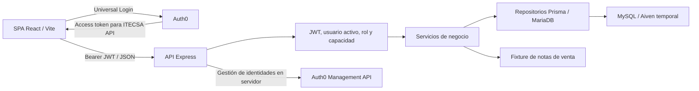

# Arquitectura de Itecsa

## Componentes y flujo

La SPA React/Vite presenta pedidos, Kanban, cobranzas, usuarios, perfil, mensajes, historial, calendario y métricas. La API Express valida identidad y capacidades, aplica reglas de negocio y persiste mediante Prisma y el adaptador MariaDB en MySQL. Itecsa utiliza Aiven como apoyo temporal de desarrollo para disponer de una BD en línea; decidió que al desplegar se eliminarán todos sus registros y se conservará sólo la estructura. El destino definitivo todavía no está decidido y no hay hosting seleccionado para SPA/API. El borrado aún no se ha ejecutado.

[shared/authorization.js](../../shared/authorization.js) define los roles y permisos que ambas capas consumen. Los directorios frontend agrupan UI, hooks y API por módulo; backend separa rutas, controladores, servicios y repositorios. `OrderService` coordina varias transiciones; el alta de Ventas delega en una unidad transaccional propia.

## Identidad y autorización

Auth0 captura y administra contraseñas. La SPA obtiene tokens mediante el SDK y consulta `GET /api/auth/verify`. El backend valida issuer, audience y claims, exige un usuario interno activo y exactamente un rol reconocido. Los permisos efectivos deben estar presentes en el token y concedidos al rol por el catálogo compartido.

La respuesta proyecta `rolUsuario`, `isAdministrador` y `permissions`; los guards de React controlan navegación y acciones visibles. El servidor vuelve a validar autorización y contexto. En operaciones protegidas con PIN, `req.pinActor` identifica al actor autenticado para la auditoría; el navegador no controla `id_usuario`.

La [guía Auth0](../auth0/README.md) concentra claims, recursos esperados, gestión de usuarios, recuperación y plantillas. La [referencia API](../desarrollo/API.md) contiene permisos y contratos. Una matriz generada describe expectativas del código, sin certificar la configuración externa del tenant.

## Persistencia y límites de integración

- Usuarios internos, clientes, pedidos, detalles, estados, registros, mensajes y datos de producción se resuelven desde la persistencia propia.
- Las notas de venta se consultan mediante [el fixture local](../../capaServidor/data/demo/sales-notes-fixture.json). Manager aún no está integrado; una NV ajena a esa fuente no se obtiene de la base propia por inferencia.
- [Orders](../modulos/ORDERS.md) recupera la fuente en servidor y escribe cliente, pedido, detalles, evento inicial y notificaciones en una unidad transaccional.
- [Payments](../modulos/PAYMENTS.md) usa una lista liviana y preview JSON, bloquea/relee el pedido para decidir el pago y escribe estado, auditoría y avisos dentro de la transacción.
- El código detecta las columnas de snapshot disponibles y omite esos campos si faltan. Esta compatibilidad no conserva nuevos snapshots en el esquema antiguo ni garantiza unicidad concurrente de la NV sin su índice. La [reconciliación y migración](../operacion/ORDERS_MIGRACION.md) siguen pendientes de entorno.
- El módulo de documentos/PDF y firmas fue retirado; el flujo vigente trabaja con datos estructurados.

## Producción y Kanban

Kanban lee pedidos y estados de la API. Los movimientos manuales exigen `move:orders`, PIN y reglas de transición; iniciar producción añade `start:production`. Completar y retroceder subprocesos tiene capacidades propias, pertenencia al detalle, estado productivo y pago confirmado.

El PATCH de movimiento devuelve campos de etapa, no el pedido completo. El frontend conserva la tarjeta y combina esos campos. Una solicitud a la etapa actual no genera escritura; los cambios concurrentes de estado se rechazan con 409. Calendario, capacidad, carga diaria y métricas usan endpoints propios, enumerados en la referencia API.

La autorización de pagos no sustituye las reglas de producción. Algunas revisiones de pago todavía requieren una decisión sobre la matriz pago × etapa, recogida en [pendientes](../PENDIENTES.md).

## Ejecución y operación

La [guía de desarrollo](../desarrollo/README.md) concentra variables y comandos locales. La SPA incorpora sus variables públicas al compilar con Vite; el servidor consume su configuración de entorno. Auth0 es externo y Aiven aloja temporalmente MySQL. Los procedimientos de base se mantienen en [migración de Orders](../operacion/ORDERS_MIGRACION.md) y [validación aislada de Payments](../operacion/PAYMENTS_SOLICITUD_BD.md). El [inventario de proveedores](../security/data-processors.md) y el [procedimiento de continuidad](../operacion/BACKUP_RESTORE.md) distinguen el estado actual de las decisiones pendientes.

Arrancar la API no aplica migraciones. Los tests locales no acreditan por sí solos configuración del tenant, protección de infraestructura, restauración de backups o cumplimiento legal; esas evidencias se registran con su entorno y fecha.

## Referencias parciales de requisitos

Este mapa se conserva como referencia documental de iteraciones anteriores; no
participa en el routing ni acredita cobertura completa de RF/UR. Requiere contrastar
cada relación con el documento fuente vigente antes de usarlo como trazabilidad.
Las rutas de la primera columna son relativas a `capaVista/src/`.

| Archivo o área | Referencias registradas |
| --- | --- |
| `app/router.jsx` | UR 1.13, UR 3.1, UR 5.1 |
| `config/routes.js` | UR 1.13, UR 3.1, UR 5.1 |
| `config/permissions.js` | UR 1.4, UR 1.13 |
| `config/status.js` | UR 3.1, UR 3.3, UR 5.2 |
| `modules/auth` | UR 1.1, UR 1.10, UR 1.11, UR 1.14, UR 1.18 |
| `modules/users` | UR 1.4, UR 1.12, UR 1.13 |
| `modules/payments` | UR 3.1, UR 3.3, UR 3.7 |
| `modules/orders` | RF42, RF43, RF44, RF45, RF46, RF47, RF48 |
| `modules/kanban` | UR 5.1, UR 5.2, UR 5.3 |
| `modules/profile` | UR 1.7 |
| `shared/components/layout` | UR 1.7, UR 1.18, UR 12.1 |
| `shared/components/navigation` | UR 1.4, UR 1.13, UR 1.14 |
| `shared/components/forms` | UR 1.1, UR 1.15, UR 2.2, UR 3.1 |
| `shared/components/data` | UR 1.4, UR 1.7, UR 3.1, UR 5.2 |
